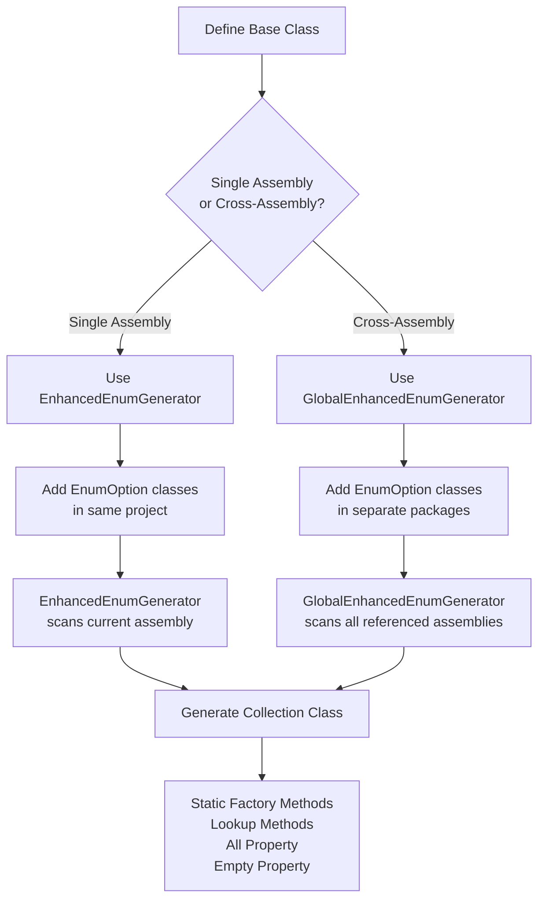
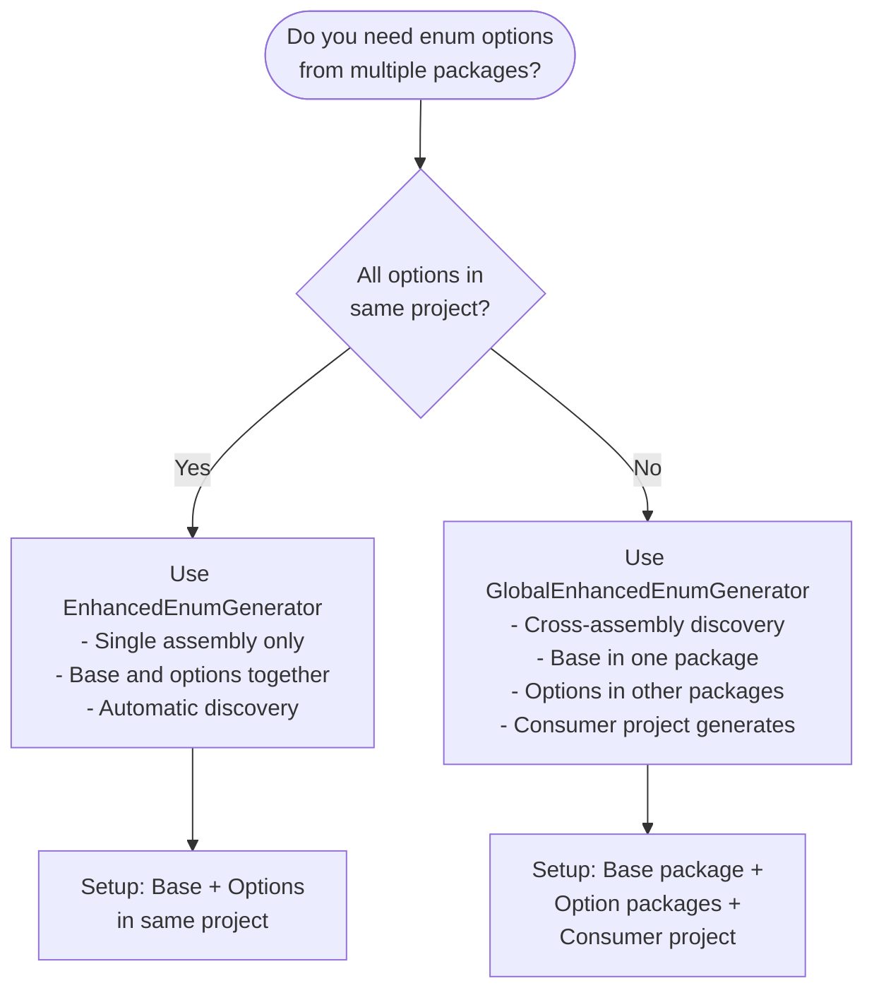
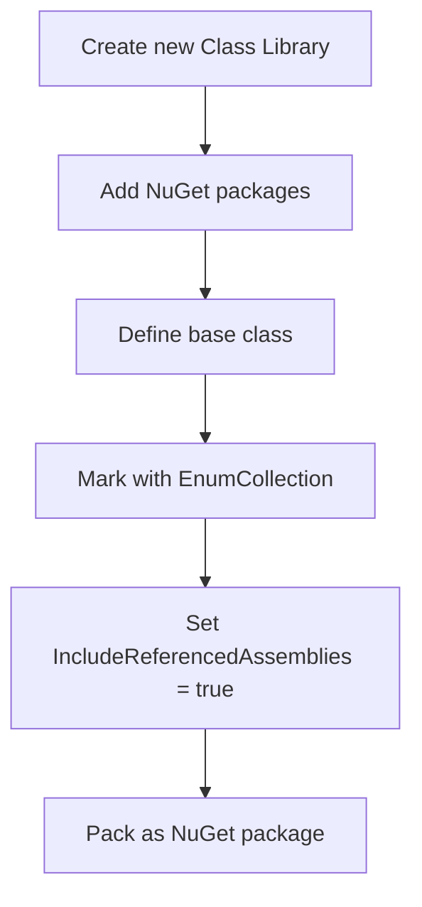
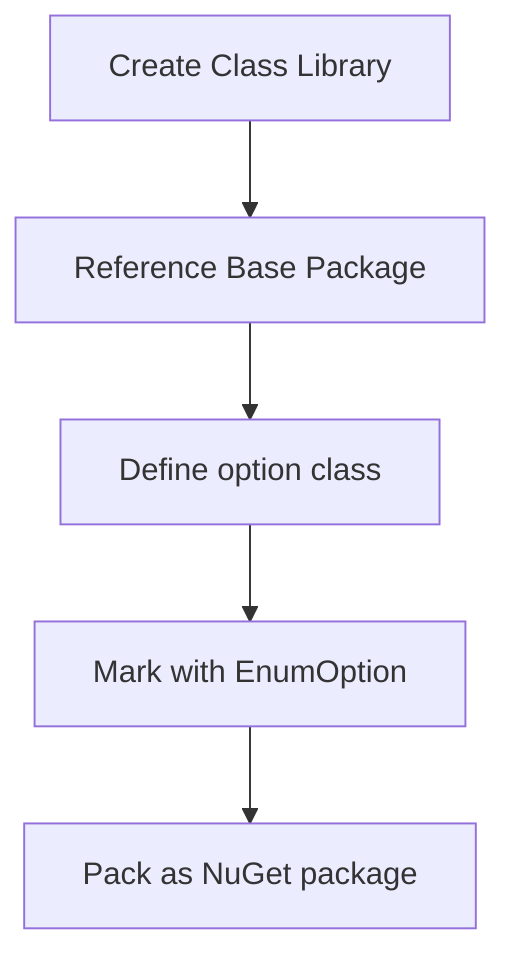
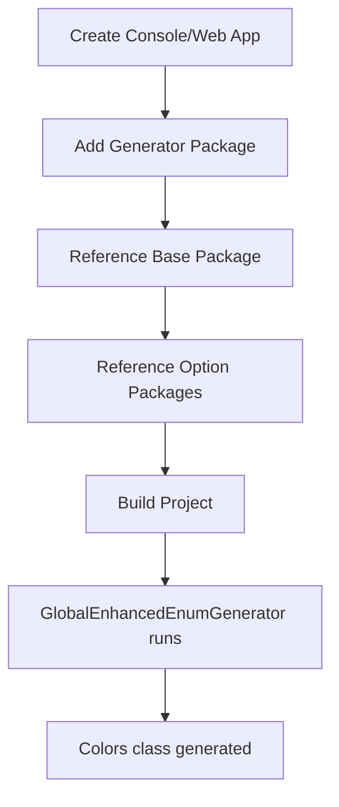
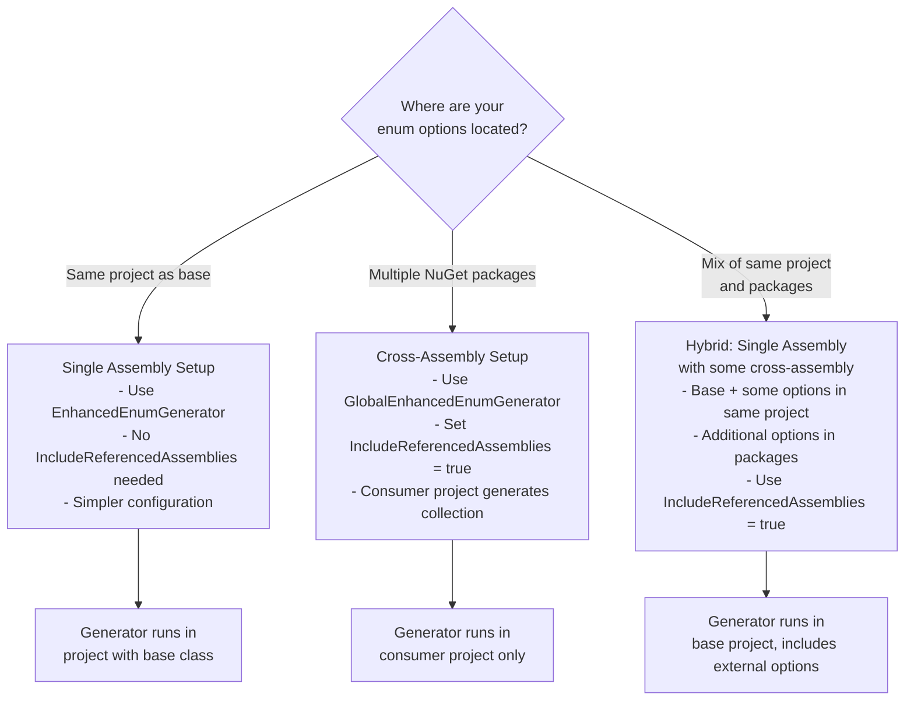

# FractalDataWorks Enhanced Enums

[](https://www.nuget.org/packages/FractalDataWorks.EnhancedEnums/)
[](LICENSE)

A powerful source generator for creating type-safe, object-oriented enumerations in C# with cross-assembly discovery and zero boilerplate.

## Table of Contents

- [Overview](#overview)
- [Installation](#installation)
- [Generator Types](#generator-types)
- [Quick Start](#quick-start)
- [Single Assembly Setup](#single-assembly-setup)
- [Cross-Assembly Setup](#cross-assembly-setup)
- [Decision Trees](#decision-trees)
- [Complete Examples](#complete-examples)
- [API Reference](#api-reference)
- [Troubleshooting](#troubleshooting)

## Overview

Enhanced Enums provides two types of source generators:

1. **EnhancedEnumGenerator** - For single assembly scenarios
2. **GlobalEnhancedEnumGenerator** - For cross-assembly scenarios with NuGet packages

### Architecture Flow



## Installation

### Required Packages

```bash
# Source generator package (required)
dotnet add package FractalDataWorks.EnhancedEnums --prerelease

# Base types and attributes package (required)
dotnet add package FractalDataWorks --prerelease
```

### MSBuild Configuration

Add to your `.csproj` files:

```xml
<PackageReference Include="FractalDataWorks.EnhancedEnums" Version="*" />
<PackageReference Include="FractalDataWorks" Version="*" />
```

## Generator Types

### Decision Matrix: Which Generator To Use?



### EnhancedEnumGenerator (Single Assembly)

**When to use:**
- All enum options are in the same project as the base class
- Simple, single-project scenarios
- Fastest compilation

**How it works:**
1. Scans current assembly only
2. Finds base classes with `[EnumCollection]`
3. Finds option classes with `[EnumOption]` in same assembly
4. Generates collection class in same assembly

### GlobalEnhancedEnumGenerator (Cross-Assembly)

**When to use:**
- Enum options are distributed across multiple NuGet packages
- Base class in one package, options in others
- Consumer needs unified collection

**How it works:**
1. Runs in consumer project only
2. Scans ALL referenced assemblies
3. Uses nested scanning: EnumCollection types first, then their options
4. Generates unified collection class in consumer project

**Requirements:**
- `IncludeReferencedAssemblies = true` on base class
- Consumer project must reference the generator
- Consumer project must reference all option packages

## Quick Start

### Single Assembly Example

```csharp
// 1. Define base class
[EnumCollection(CollectionName = "OrderStatuses")]
public abstract class OrderStatusBase : EnumOptionBase<OrderStatusBase>
{
    public abstract bool CanCancel { get; }
    
    protected OrderStatusBase(int id, string name, bool canCancel) : base(id, name)
    {
        CanCancel = canCancel;
    }
}

// 2. Define options in same project
[EnumOption]
public class Pending : OrderStatusBase
{
    public Pending() : base(1, "Pending", true) { }
}

[EnumOption]
public class Shipped : OrderStatusBase
{
    public Shipped() : base(2, "Shipped", false) { }
}

// 3. Use generated collection
var pending = OrderStatuses.Pending();
var all = OrderStatuses.All;
var byName = OrderStatuses.GetByName("Shipped");
```

### Cross-Assembly Example

```csharp
// Package 1: Base Types (ColorOption.Library)
[EnumCollection(
    CollectionName = "Colors", 
    IncludeReferencedAssemblies = true,  // REQUIRED for cross-assembly
    GenerateFactoryMethods = true)]
public abstract class ColorOptionBase : EnumOptionBase<ColorOptionBase>
{
    public string Hex { get; }
    
    protected ColorOptionBase(int id, string name, string hex) : base(id, name)
    {
        Hex = hex;
    }
}

// Package 2: Red Option (Red.Library)
[EnumOption]
public class Red : ColorOptionBase
{
    public Red() : base(1, "Red", "#FF0000") { }
}

// Package 3: Blue Option (Blue.Library)  
[EnumOption]
public class Blue : ColorOptionBase
{
    public Blue() : base(2, "Blue", "#0000FF") { }
}

// Consumer Project: References all packages + generator
// Colors class generated here with all options
var red = Colors.Red();
var blue = Colors.Blue();
var all = Colors.All; // Contains both Red and Blue
```

## Single Assembly Setup

### Step-by-Step Instructions

```mermaid
flowchart TD
    A[1. Create new project] --> B[2. Add NuGet packages]
    B --> C[3. Define base class with<br/>[EnumCollection]]
    C --> D[4. Add option classes with<br/>[EnumOption]]
    D --> E[5. Build project]
    E --> F[6. Use generated collection]
    
    B1[FractalDataWorks.EnhancedEnums<br/>FractalDataWorks]
    C1["[EnumCollection(CollectionName = 'Statuses')]<br/>class StatusBase : EnumOptionBase&lt;StatusBase&gt;"]
    D1["[EnumOption]<br/>class Active : StatusBase"]
    F1[Statuses.Active()<br/>Statuses.All<br/>Statuses.GetByName()]
    
    B -.-> B1
    C -.-> C1
    D -.-> D1
    F -.-> F1
```

### Complete Single Assembly Example

```csharp
// File: Models/StatusBase.cs
using FractalDataWorks;

namespace MyApp.Models;

[EnumCollection(CollectionName = "Statuses")]
public abstract class StatusBase : EnumOptionBase<StatusBase>
{
    public abstract string Code { get; }
    public abstract bool IsActive { get; }
    
    protected StatusBase(int id, string name, string code, bool isActive) : base(id, name)
    {
        Code = code;
        IsActive = isActive;
    }
}

// File: Models/Active.cs
[EnumOption]
public class Active : StatusBase
{
    public Active() : base(1, "Active", "ACT", true) { }
}

// File: Models/Inactive.cs
[EnumOption]
public class Inactive : StatusBase
{
    public Inactive() : base(2, "Inactive", "INA", false) { }
}

// Usage after build:
var active = Statuses.Active();
var inactive = Statuses.GetByName("Inactive");
var allStatuses = Statuses.All;
```

## Cross-Assembly Setup

### Architecture Diagram

```mermaid
graph LR
    subgraph "Base Package"
        A[ColorOptionBase<br/>with [EnumCollection]<br/>IncludeReferencedAssemblies = true]
    end
    
    subgraph "Red.Library Package"
        B[Red class<br/>with [EnumOption]]
    end
    
    subgraph "Blue.Library Package"
        C[Blue class<br/>with [EnumOption]]
    end
    
    subgraph "Consumer Project"
        D[References all packages<br/>+ FractalDataWorks.EnhancedEnums]
        E[Generated Colors class<br/>with all options]
    end
    
    A --> D
    B --> D
    C --> D
    D --> E
```

### Step-by-Step Cross-Assembly Setup

#### Step 1: Create Base Package



```csharp
// File: ColorOption.Library/ColorOptionBase.cs
using FractalDataWorks;
using FractalDataWorks.Attributes;

namespace ColorOption.Library;

[EnumCollection(
    CollectionName = "Colors",
    IncludeReferencedAssemblies = true,  // CRITICAL for cross-assembly
    GenerateFactoryMethods = true,
    NameComparison = StringComparison.OrdinalIgnoreCase)]
public abstract class ColorOptionBase : EnumOptionBase<ColorOptionBase>
{
    public string Hex { get; }
    
    [EnumLookup("GetByValue")]  // Optional: Custom lookup
    public int Value { get; }
    
    protected ColorOptionBase(int id, string name, string hex, int value) : base(id, name)
    {
        Hex = hex;
        Value = value;
    }
}
```

```xml
<!-- ColorOption.Library.csproj -->
<Project Sdk="Microsoft.NET.Sdk">
  <PropertyGroup>
    <TargetFramework>net8.0</TargetFramework>
    <IsPackable>true</IsPackable>
  </PropertyGroup>
  
  <ItemGroup>
    <PackageReference Include="FractalDataWorks" Version="*" />
  </ItemGroup>
</Project>
```

#### Step 2: Create Option Packages



```csharp
// File: Red.Library/Red.cs
using FractalDataWorks;
using ColorOption.Library;

namespace Red.Library;

[EnumOption]
public class Red : ColorOptionBase
{
    public Red() : base(1, "Red", "#FF0000", 1) { }
}
```

```xml
<!-- Red.Library.csproj -->
<Project Sdk="Microsoft.NET.Sdk">
  <PropertyGroup>
    <TargetFramework>net8.0</TargetFramework>
    <IsPackable>true</IsPackable>
  </PropertyGroup>
  
  <ItemGroup>
    <PackageReference Include="ColorOption.Library" Version="*" />
  </ItemGroup>
</Project>
```

#### Step 3: Create Consumer Project



```xml
<!-- ConsoleApp.csproj -->
<Project Sdk="Microsoft.NET.Sdk">
  <PropertyGroup>
    <OutputType>Exe</OutputType>
    <TargetFramework>net8.0</TargetFramework>
  </PropertyGroup>

  <!-- REQUIRED: Source generator -->
  <ItemGroup>
    <ProjectReference Include="path/to/FractalDataWorks.EnhancedEnums.csproj" 
                      OutputItemType="Analyzer" 
                      ReferenceOutputAssembly="false" />
  </ItemGroup>

  <!-- Package references -->
  <ItemGroup>
    <PackageReference Include="ColorOption.Library" Version="*" />
    <PackageReference Include="Red.Library" Version="*" />
    <PackageReference Include="Blue.Library" Version="*" />
  </ItemGroup>
</Project>
```

```csharp
// Program.cs
using ColorOption.Library;

Console.WriteLine("Cross Assembly Colors:");

// Generated Colors class contains all options
foreach (var color in Colors.All)
{
    Console.WriteLine($"{color.Name}: {color.Hex} (Value: {color.Value})");
}

// Factory methods work
var red = Colors.Red();
var blue = Colors.Blue();

// Lookups work
var redByName = Colors.GetByName("Red");
var blueByValue = Colors.GetByValue(2);  // Custom lookup from [EnumLookup]
```

### Cross-Assembly Project Structure

```
Solution/
├── ColorOption.Library/           # Base package
│   ├── ColorOptionBase.cs         # [EnumCollection(IncludeReferencedAssemblies = true)]
│   └── ColorOption.Library.csproj # References: FractalDataWorks
├── Red.Library/                   # Option package
│   ├── Red.cs                     # [EnumOption]
│   └── Red.Library.csproj         # References: ColorOption.Library
├── Blue.Library/                  # Option package
│   ├── Blue.cs                    # [EnumOption] 
│   └── Blue.Library.csproj        # References: ColorOption.Library
└── ConsoleApp/                    # Consumer
    ├── Program.cs                 # Uses Colors.All, Colors.Red(), etc.
    └── ConsoleApp.csproj           # References: All packages + Generator
```

## Decision Trees

### Choosing Configuration Options

#### Factory Methods Decision Tree

```mermaid
flowchart TD
    A{Do you need to create<br/>new instances with<br/>different parameters?} 
    
    A -->|Yes| B[Set GenerateFactoryMethods = true<br/>Factory methods create new instances<br/>GetByName() returns singletons]
    
    A -->|No| C{Do you need the<br/>fastest possible<br/>performance?}
    
    C -->|Yes| D[Set GenerateFactoryMethods = false<br/>Use GetByName() for all access<br/>No factory method overhead]
    
    C -->|No| E[Keep default: true<br/>Provides both options]
    
    B --> F[Usage: Colors.Red() creates new<br/>Colors.GetByName('Red') returns singleton]
    D --> G[Usage: Colors.GetByName('Red') only<br/>No Colors.Red() method available]
    E --> H[Usage: Both available<br/>Choose based on need]
```

#### Cross-Assembly vs Single Assembly



### Lookup Methods Decision Tree

```mermaid
flowchart TD
    A{Do you need custom<br/>property lookups?} 
    
    A -->|No| B[Use built-in methods:<br/>- GetByName(string)<br/>- GetById(int) if EnumOptionBase<br/>- All property<br/>- Empty property]
    
    A -->|Yes| C{What type of lookup?}
    
    C -->|Single result| D[Add [EnumLookup('GetByCustom')] to property<br/>Generates: GetByCustom(PropertyType)<br/>Returns: BaseType? (nullable)]
    
    C -->|Multiple results| E[Add [EnumLookup('GetByCustom', AllowMultiple = true)]<br/>Generates: GetByCustom(PropertyType)<br/>Returns: ImmutableArray&lt;BaseType&gt;]
    
    C -->|Custom return type| F[Add [EnumLookup('GetByCustom', ReturnType = typeof(ICustom))]<br/>Generates: GetByCustom(PropertyType)<br/>Returns: ICustom?]
    
    D --> G[Property must be in constructor<br/>or be nullable]
    E --> G
    F --> G
```

## Complete Examples

### Example 1: Order Status System (Single Assembly)

```csharp
// Models/OrderStatusBase.cs
using FractalDataWorks;
using FractalDataWorks.Attributes;

namespace OrderSystem.Models;

[EnumCollection(
    CollectionName = "OrderStatuses",
    GenerateFactoryMethods = true,
    NameComparison = StringComparison.OrdinalIgnoreCase)]
public abstract class OrderStatusBase : EnumOptionBase<OrderStatusBase>
{
    public abstract string Code { get; }
    public abstract bool CanCancel { get; }
    public abstract bool CanShip { get; }
    
    [EnumLookup("GetByCode")]
    public abstract string StatusCode { get; }
    
    [EnumLookup("FindByCancel", AllowMultiple = true)]
    public abstract bool Cancellable { get; }
    
    protected OrderStatusBase(int id, string name, string code, bool canCancel, bool canShip) 
        : base(id, name)
    {
        Code = code;
        CanCancel = canCancel;
        CanShip = canShip;
        StatusCode = code;  // For lookup
        Cancellable = canCancel;  // For lookup
    }
}

// Models/Pending.cs
[EnumOption]
public class Pending : OrderStatusBase
{
    public Pending() : base(1, "Pending", "PEND", true, false) { }
}

// Models/Processing.cs
[EnumOption]
public class Processing : OrderStatusBase
{
    public Processing() : base(2, "Processing", "PROC", true, false) { }
}

// Models/Shipped.cs
[EnumOption]
public class Shipped : OrderStatusBase
{
    public Shipped() : base(3, "Shipped", "SHIP", false, false) { }
}

// Models/Delivered.cs
[EnumOption]
public class Delivered : OrderStatusBase
{
    public Delivered() : base(4, "Delivered", "DELV", false, false) { }
}

// Usage Examples:
class OrderService
{
    public void ProcessOrder(int orderId)
    {
        // Factory methods
        var pending = OrderStatuses.Pending();
        var processing = OrderStatuses.Processing();
        
        // Name lookup
        var status = OrderStatuses.GetByName("Shipped");
        
        // Custom lookups
        var byCode = OrderStatuses.GetByCode("PEND");
        var cancellableStatuses = OrderStatuses.FindByCancel(true);
        
        // All statuses
        foreach (var s in OrderStatuses.All)
        {
            Console.WriteLine($"{s.Name} ({s.Code}): Cancel={s.CanCancel}, Ship={s.CanShip}");
        }
        
        // Safe lookups
        if (OrderStatuses.TryGetByName("Unknown", out var found))
        {
            Console.WriteLine($"Found: {found.Name}");
        }
        
        // Empty pattern
        var emptyStatus = OrderStatuses.Empty;
        Console.WriteLine($"Empty status: {emptyStatus.Name} (ID: {emptyStatus.Id})");
    }
}
```

### Example 2: Plugin System (Cross-Assembly)

#### Base Package: PluginSystem.Core

```csharp
// IPlugin.cs
namespace PluginSystem.Core;

public interface IPlugin
{
    string Name { get; }
    string Version { get; }
    void Execute();
}

// PluginBase.cs
using FractalDataWorks;

[EnumCollection(
    CollectionName = "Plugins",
    IncludeReferencedAssemblies = true,  // Enable cross-assembly
    GenerateFactoryMethods = true,
    ReturnType = typeof(IPlugin))]       // Return interface type
public abstract class PluginBase : EnumOptionBase<PluginBase>, IPlugin
{
    public abstract string Version { get; }
    public abstract string Category { get; }
    
    [EnumLookup("GetByVersion")]
    public abstract string PluginVersion { get; }
    
    [EnumLookup("GetByCategory", AllowMultiple = true)]
    public abstract string PluginCategory { get; }
    
    protected PluginBase(int id, string name, string version, string category) : base(id, name)
    {
        Version = version;
        Category = category;
        PluginVersion = version;    // For lookup
        PluginCategory = category;  // For lookup
    }
    
    public abstract void Execute();
}
```

#### Option Package 1: DatabasePlugin

```csharp
// DatabasePlugin.cs
using PluginSystem.Core;
using FractalDataWorks;

namespace DatabasePlugin;

[EnumOption]
public class SqlServerPlugin : PluginBase
{
    public SqlServerPlugin() : base(1, "SQL Server", "1.0.0", "Database") { }
    
    public override void Execute()
    {
        Console.WriteLine("Executing SQL Server plugin...");
    }
}

[EnumOption]
public class MySqlPlugin : PluginBase
{
    public MySqlPlugin() : base(2, "MySQL", "1.2.0", "Database") { }
    
    public override void Execute()
    {
        Console.WriteLine("Executing MySQL plugin...");
    }
}
```

#### Option Package 2: FilePlugin

```csharp
// FilePlugin.cs  
using PluginSystem.Core;
using FractalDataWorks;

namespace FilePlugin;

[EnumOption]
public class CsvPlugin : PluginBase
{
    public CsvPlugin() : base(3, "CSV Processor", "2.0.0", "File") { }
    
    public override void Execute()
    {
        Console.WriteLine("Processing CSV files...");
    }
}

[EnumOption]
public class JsonPlugin : PluginBase
{
    public JsonPlugin() : base(4, "JSON Processor", "1.5.0", "File") { }
    
    public override void Execute()
    {
        Console.WriteLine("Processing JSON files...");
    }
}
```

#### Consumer Application

```csharp
// Program.cs
using PluginSystem.Core;

class Program
{
    static void Main()
    {
        Console.WriteLine("Available Plugins:");
        
        // Plugins class generated with all cross-assembly options
        foreach (IPlugin plugin in Plugins.All)
        {
            Console.WriteLine($"- {plugin.Name} v{plugin.Version} ({plugin.Category})");
        }
        
        // Factory methods return IPlugin (configured ReturnType)
        IPlugin sqlServer = Plugins.SqlServerPlugin();
        IPlugin csvProcessor = Plugins.CsvPlugin();
        
        // Custom lookups work across assemblies
        var databasePlugins = Plugins.GetByCategory("Database");
        var v1Plugins = Plugins.GetByVersion("1.0.0");
        
        // Execute all database plugins
        foreach (var dbPlugin in databasePlugins)
        {
            dbPlugin.Execute();
        }
    }
}
```

## API Reference

### Attributes

#### `[EnumCollection]`

Marks a class as an enhanced enum base type.

**Properties:**
- `CollectionName` (string, required): Name of generated collection class
- `GenerateFactoryMethods` (bool): Generate factory methods. Default: `true`
- `NameComparison` (StringComparison): String comparison for lookups. Default: `Ordinal`
- `ReturnType` (Type): Return type for methods. Use `typeof(IInterface)`
- `Namespace` (string): Target namespace for generated class
- `DefaultGenericReturnType` (Type): Return type for generic bases
- `IncludeReferencedAssemblies` (bool): Enable cross-assembly discovery. Default: `false`

**Example:**
```csharp
[EnumCollection(
    CollectionName = "Colors",
    GenerateFactoryMethods = true,
    NameComparison = StringComparison.OrdinalIgnoreCase,
    ReturnType = typeof(IColor),
    IncludeReferencedAssemblies = true)]
```

#### `[EnumOption]`

Marks a class as an enum option.

**Properties:**
- `Name` (string): Override display name. Default: class name
- `CollectionName` (string): Target collection for multi-collection scenarios
- `ReturnType` (Type): Custom return type for this option
- `GenerateFactoryMethod` (bool?): Override factory method generation
- `MethodName` (string): Custom factory method name

#### `[EnumLookup]`

Generates custom lookup methods for properties.

**Constructor Parameters:**
- `methodName` (string): Name of generated method. Default: `GetBy{PropertyName}`
- `allowMultiple` (bool): Return multiple results. Default: `false`
- `returnType` (Type): Custom return type for lookup method

**Requirements:**
- Property must be included in constructor parameters OR be nullable
- Property must be abstract or virtual

### Generated API

For base class `StatusBase` with `CollectionName = "Statuses"`:

```csharp
public static class Statuses
{
    // Properties
    public static ImmutableArray<StatusBase> All { get; }
    public static StatusBase Empty { get; }
    
    // Factory methods (if enabled)
    public static StatusBase Active() => new Active();
    public static StatusBase Inactive() => new Inactive();
    
    // Built-in lookups
    public static StatusBase? GetByName(string name);
    public static bool TryGetByName(string name, out StatusBase? result);
    public static StatusBase? GetById(int id);  // If using EnumOptionBase
    
    // Custom lookups (from [EnumLookup])
    public static StatusBase? GetByCode(string code);
    public static ImmutableArray<StatusBase> GetByCategory(string category);  // If AllowMultiple
}
```

## Troubleshooting

### Common Issues Flow Chart

```mermaid
flowchart TD
    A[Issue: Generator not running] --> B{Check packages}
    B -->|Missing| C[Add both packages:<br/>FractalDataWorks.EnhancedEnums<br/>FractalDataWorks]
    B -->|Present| D{Check for compilation errors}
    D -->|Errors exist| E[Fix compilation errors<br/>Generators don't run with errors]
    D -->|No errors| F[Clean and rebuild solution]
    
    G[Issue: Cross-assembly not working] --> H{Check IncludeReferencedAssemblies}
    H -->|False/Missing| I[Set IncludeReferencedAssemblies = true<br/>on base class]
    H -->|True| J{Check consumer project}
    J -->|Missing generator| K[Add FractalDataWorks.EnhancedEnums<br/>to consumer project as Analyzer]
    J -->|Missing packages| L[Add all option packages<br/>to consumer project]
    
    M[Issue: Methods not generated] --> N{Check EnumOption attributes}
    N -->|Missing| O[Add [EnumOption] to option classes]
    N -->|Present| P{Check base class inheritance}
    P -->|Wrong| Q[Base must inherit from<br/>EnumOptionBase&lt;T&gt;]
    P -->|Correct| R[Check for abstract properties<br/>without constructor parameters]
```

### Specific Error Solutions

#### "Collection class not generated"

1. **Check base class inheritance:**
   ```csharp
   // ❌ Wrong
   public abstract class StatusBase { }
   
   // ✅ Correct
   public abstract class StatusBase : EnumOptionBase<StatusBase> { }
   ```

2. **Check CollectionName:**
   ```csharp
   // ❌ Missing CollectionName
   [EnumCollection]
   
   // ✅ Explicit CollectionName
   [EnumCollection(CollectionName = "Statuses")]
   ```

#### "Cross-assembly options not found"

1. **Enable cross-assembly scanning:**
   ```csharp
   [EnumCollection(
       CollectionName = "Colors",
       IncludeReferencedAssemblies = true)]  // Required!
   ```

2. **Check consumer project references:**
   ```xml
   <!-- Must reference generator -->
   <ProjectReference Include="path/to/FractalDataWorks.EnhancedEnums.csproj" 
                     OutputItemType="Analyzer" />
   
   <!-- Must reference all option packages -->
   <PackageReference Include="Red.Library" Version="*" />
   <PackageReference Include="Blue.Library" Version="*" />
   ```

#### "Custom lookup methods not generated"

1. **Check [EnumLookup] syntax:**
   ```csharp
   // ❌ Wrong - no method name
   [EnumLookup]
   public abstract string Code { get; }
   
   // ✅ Correct - explicit method name
   [EnumLookup("GetByCode")]
   public abstract string Code { get; }
   ```

2. **Check constructor parameters:**
   ```csharp
   [EnumLookup("GetByCode")]
   public abstract string Code { get; }
   
   // Constructor must include Code parameter
   protected StatusBase(int id, string name, string code) : base(id, name)
   {
       Code = code;  // Required!
   }
   ```

#### "Factory methods not working"

1. **Check GenerateFactoryMethods setting:**
   ```csharp
   [EnumCollection(
       CollectionName = "Statuses",
       GenerateFactoryMethods = true)]  // Must be true
   ```

2. **Check for parameterless constructor:**
   ```csharp
   [EnumOption]
   public class Active : StatusBase
   {
       public Active() : base(1, "Active", "ACT") { }  // Required!
   }
   ```

### Project Setup Validation

Use this checklist to validate your setup:

#### Single Assembly Checklist
- [ ] Added both NuGet packages
- [ ] Base class inherits from `EnumOptionBase<T>`
- [ ] Base class has `[EnumCollection(CollectionName = "...")]`
- [ ] Option classes have `[EnumOption]`
- [ ] Option classes inherit from base class
- [ ] All abstract properties included in constructor
- [ ] Project builds without errors

#### Cross-Assembly Checklist
- [ ] Base package: Has `IncludeReferencedAssemblies = true`
- [ ] Option packages: Reference base package
- [ ] Option packages: Have `[EnumOption]` classes
- [ ] Consumer project: References generator as Analyzer
- [ ] Consumer project: References all option packages
- [ ] Consumer project: References base package
- [ ] All projects build without errors
- [ ] Generated collection class appears in consumer project

## PowerShell Build Script

Create this script to properly pack and deploy packages for cross-assembly scenarios:

```powershell
# BuildAndPackEnhancedEnums.ps1
param(
    [string]$OutputPath = "LocalPackages",
    [string]$Configuration = "Release"
)

Write-Host "Building and Packing Enhanced Enums packages..." -ForegroundColor Green

# Create output directory
if (!(Test-Path $OutputPath)) {
    New-Item -ItemType Directory -Path $OutputPath -Force
}

# Base packages
$basePackages = @(
    "src/FractalDataWorks/FractalDataWorks.csproj",
    "src/FractalDataWorks.EnhancedEnums/FractalDataWorks.EnhancedEnums.csproj"
)

# Sample packages for cross-assembly
$samplePackages = @(
    "samples/CrossAssemblyScanner/ColorOption.Library/ColorOption.Library.csproj",
    "samples/CrossAssemblyScanner/Red.Library/Red.Library.csproj", 
    "samples/CrossAssemblyScanner/Blue.Library/Blue.Library.csproj"
)

foreach ($project in $basePackages) {
    Write-Host "Packing $project..." -ForegroundColor Yellow
    dotnet pack $project --configuration $Configuration --output $OutputPath --force
    if ($LASTEXITCODE -ne 0) {
        Write-Error "Failed to pack $project"
        exit 1
    }
}

foreach ($project in $samplePackages) {
    Write-Host "Packing $project..." -ForegroundColor Yellow
    dotnet pack $project --configuration $Configuration --output $OutputPath --force
    if ($LASTEXITCODE -ne 0) {
        Write-Error "Failed to pack $project"
        exit 1
    }
}

Write-Host "All packages built successfully!" -ForegroundColor Green
Write-Host "Output directory: $OutputPath" -ForegroundColor Cyan

# List generated packages
Get-ChildItem $OutputPath -Filter "*.nupkg" | ForEach-Object {
    Write-Host "  - $($_.Name)" -ForegroundColor White
}
```

Save as `BuildAndPackEnhancedEnums.ps1` and run:
```powershell
./BuildAndPackEnhancedEnums.ps1 -OutputPath "LocalPackages" -Configuration "Release"
```