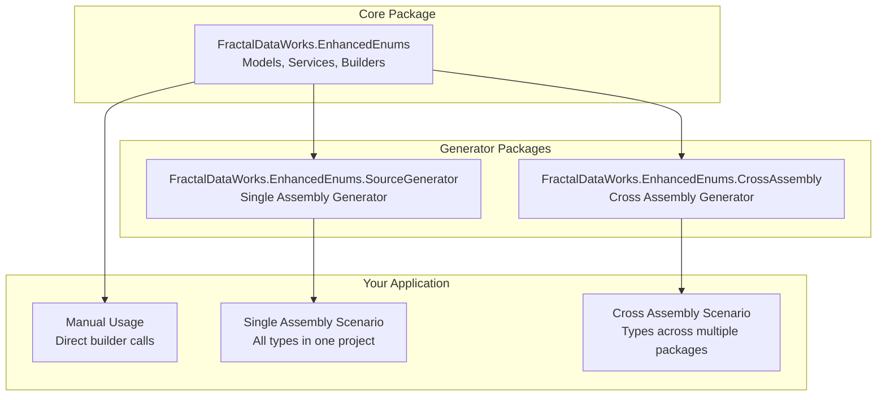
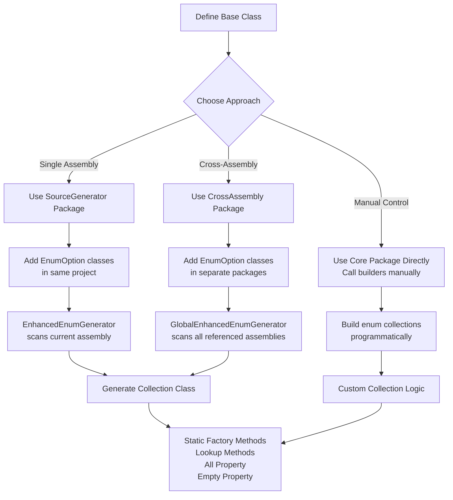
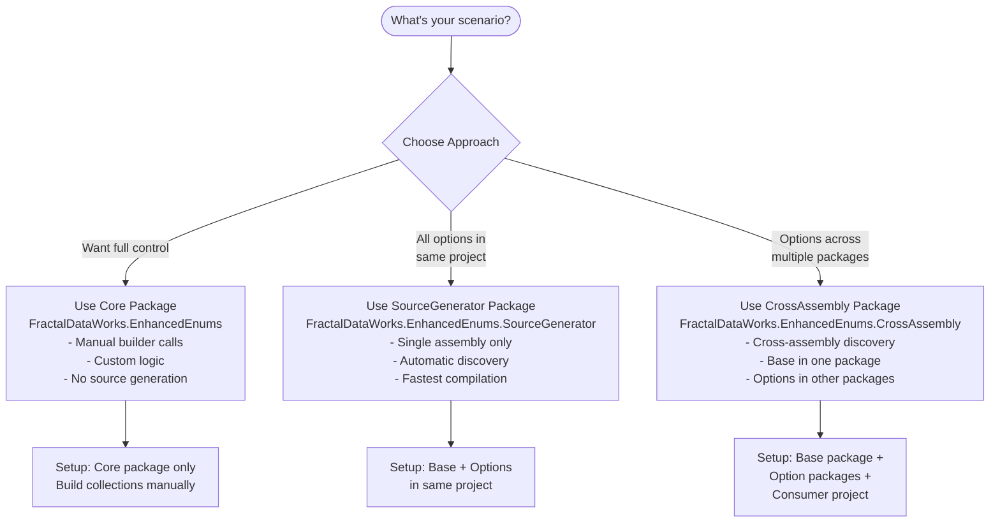
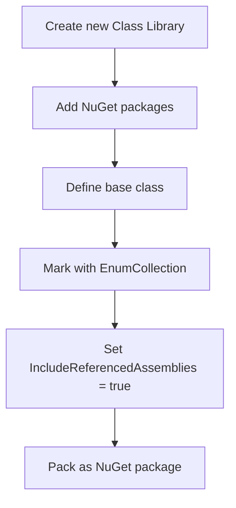
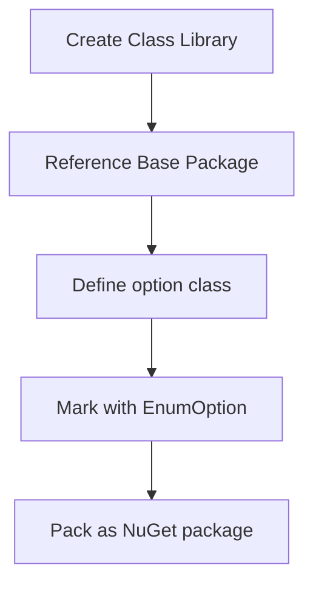
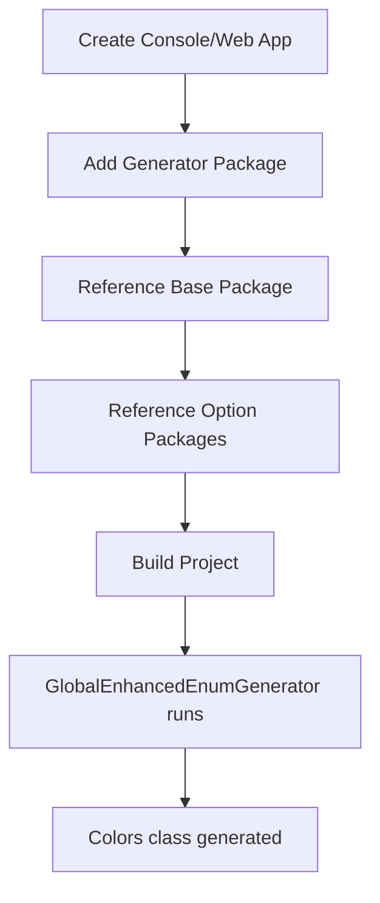
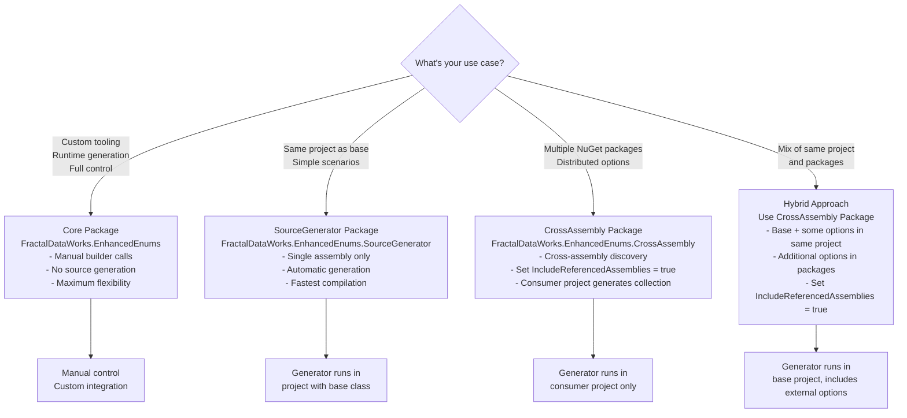
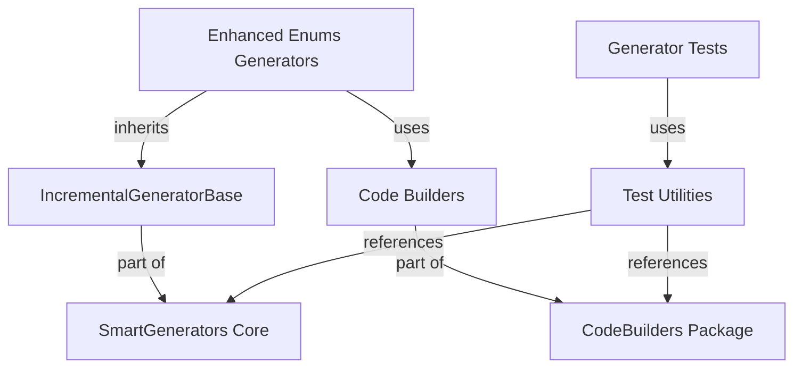
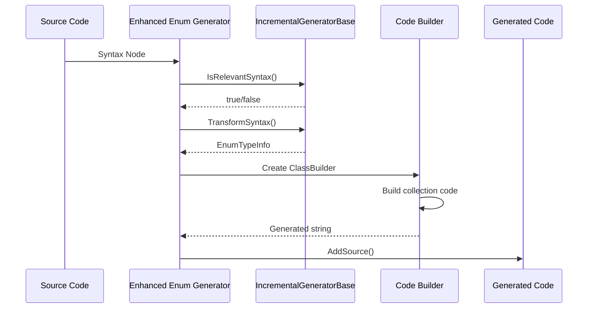
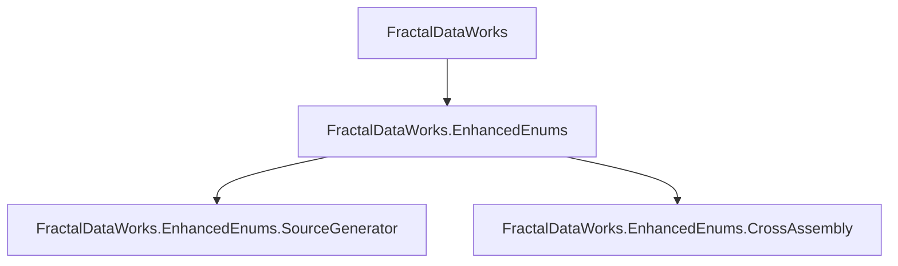

# FractalDataWorks Enhanced Enums

[](https://www.nuget.org/packages/FractalDataWorks.EnhancedEnums/)
[](LICENSE)

A powerful source generator suite for creating type-safe, object-oriented enumerations in C# with cross-assembly discovery and zero boilerplate.

## Table of Contents

- [Overview](#overview)
- [Installation](#installation)
- [Package Types](#package-types)
- [Quick Start](#quick-start)
- [Single Assembly Setup](#single-assembly-setup)
- [Cross-Assembly Setup](#cross-assembly-setup)
- [Manual Usage](#manual-usage)
- [Decision Trees](#decision-trees)
- [Complete Examples](#complete-examples)
- [API Reference](#api-reference)
- [Debugging & Development](#debugging--development)
- [Smart Generators Framework](#smart-generators-framework)
- [Troubleshooting](#troubleshooting)

## Overview

Enhanced Enums provides a modular architecture with three specialized packages:

1. **FractalDataWorks.EnhancedEnums** - Core models, services, and builders (shared library)
2. **FractalDataWorks.EnhancedEnums.SourceGenerator** - Single-assembly source generator
3. **FractalDataWorks.EnhancedEnums.CrossAssembly** - Cross-assembly source generator

### Package Architecture



### Usage Flow



## Installation

Choose the package that fits your scenario:

### For Single Assembly (Most Common)

```bash
# Single assembly source generator + core library
dotnet add package FractalDataWorks.EnhancedEnums.SourceGenerator --prerelease

# Base types and attributes (required)
dotnet add package FractalDataWorks --prerelease
```

### For Cross-Assembly

```bash
# Cross-assembly source generator + core library
dotnet add package FractalDataWorks.EnhancedEnums.CrossAssembly --prerelease

# Base types and attributes (required)
dotnet add package FractalDataWorks --prerelease
```

### For Manual Usage

```bash
# Core builders and services only
dotnet add package FractalDataWorks.EnhancedEnums --prerelease

# Base types and attributes (required)
dotnet add package FractalDataWorks --prerelease
```

### MSBuild Configuration

```xml
<!-- Single Assembly -->
<PackageReference Include="FractalDataWorks.EnhancedEnums.SourceGenerator" Version="*" />
<PackageReference Include="FractalDataWorks" Version="*" />

<!-- OR Cross-Assembly -->
<PackageReference Include="FractalDataWorks.EnhancedEnums.CrossAssembly" Version="*" />
<PackageReference Include="FractalDataWorks" Version="*" />

<!-- OR Manual Usage -->
<PackageReference Include="FractalDataWorks.EnhancedEnums" Version="*" />
<PackageReference Include="FractalDataWorks" Version="*" />
```

## Package Types

### Decision Matrix: Which Package To Use?



### Core Package (FractalDataWorks.EnhancedEnums)

**When to use:**
- You want manual control over enum generation
- Building custom tooling or integrations
- Need to call builders programmatically
- Don't want source generation

**What it provides:**
- Models: `EnumTypeInfo`, `EnumValueInfo`, `PropertyLookupInfo`
- Services: `EnumCollectionBuilder`, `LookupMethodsBuilder`, `FactoryMethodsBuilder`
- Discovery: `EnumValueDiscoveryService`, `TypeDiscoveryService`

### SourceGenerator Package (Single Assembly)

**When to use:**
- All enum options are in the same project as the base class
- Simple, single-project scenarios
- Fastest compilation

**How it works:**
1. Scans current assembly only
2. Finds base classes with `[EnumCollection]`
3. Finds option classes with `[EnumOption]` in same assembly
4. Generates collection class in same assembly

### CrossAssembly Package (Cross-Assembly)

**When to use:**
- Enum options are distributed across multiple NuGet packages
- Base class in one package, options in others
- Consumer needs unified collection

**How it works:**
1. Runs in consumer project only
2. Scans ALL referenced assemblies
3. Uses nested scanning: EnumCollection types first, then their options
4. Generates unified collection class in consumer project

**Requirements:**
- `IncludeReferencedAssemblies = true` on base class
- Consumer project must reference the generator
- Consumer project must reference all option packages

## Quick Start

### Single Assembly Example

```csharp
// 1. Define base class
[EnumCollection(CollectionName = "OrderStatuses")]
public abstract class OrderStatusBase : EnumOptionBase<OrderStatusBase>
{
    public abstract bool CanCancel { get; }
    
    protected OrderStatusBase(int id, string name, bool canCancel) : base(id, name)
    {
        CanCancel = canCancel;
    }
}

// 2. Define options in same project
[EnumOption]
public class Pending : OrderStatusBase
{
    public Pending() : base(1, "Pending", true) { }
}

[EnumOption]
public class Shipped : OrderStatusBase
{
    public Shipped() : base(2, "Shipped", false) { }
}

// 3. Use generated collection
var pending = OrderStatuses.Pending();
var all = OrderStatuses.All;
var byName = OrderStatuses.GetByName("Shipped");
```

### Cross-Assembly Example

```csharp
// Package 1: Base Types (ColorOption.Library)
[EnumCollection(
    CollectionName = "Colors", 
    IncludeReferencedAssemblies = true,  // REQUIRED for cross-assembly
    GenerateFactoryMethods = true)]
public abstract class ColorOptionBase : EnumOptionBase<ColorOptionBase>
{
    public string Hex { get; }
    
    protected ColorOptionBase(int id, string name, string hex) : base(id, name)
    {
        Hex = hex;
    }
}

// Package 2: Red Option (Red.Library)
[EnumOption]
public class Red : ColorOptionBase
{
    public Red() : base(1, "Red", "#FF0000") { }
}

// Package 3: Blue Option (Blue.Library)  
[EnumOption]
public class Blue : ColorOptionBase
{
    public Blue() : base(2, "Blue", "#0000FF") { }
}

// Consumer Project: References all packages + generator
// Colors class generated here with all options
var red = Colors.Red();
var blue = Colors.Blue();
var all = Colors.All; // Contains both Red and Blue
```

## Single Assembly Setup

### Step-by-Step Instructions

```mermaid
flowchart TD
    A[1. Create new project] --> B[2. Add NuGet packages]
    B --> C[3. Define base class with<br/>[EnumCollection]]
    C --> D[4. Add option classes with<br/>[EnumOption]]
    D --> E[5. Build project]
    E --> F[6. Use generated collection]
    
    B1[FractalDataWorks.EnhancedEnums<br/>FractalDataWorks]
    C1["[EnumCollection(CollectionName = 'Statuses')]<br/>class StatusBase : EnumOptionBase&lt;StatusBase&gt;"]
    D1["[EnumOption]<br/>class Active : StatusBase"]
    F1[Statuses.Active()<br/>Statuses.All<br/>Statuses.GetByName()]
    
    B -.-> B1
    C -.-> C1
    D -.-> D1
    F -.-> F1
```

### Complete Single Assembly Example

```csharp
// File: Models/StatusBase.cs
using FractalDataWorks;

namespace MyApp.Models;

[EnumCollection(CollectionName = "Statuses")]
public abstract class StatusBase : EnumOptionBase<StatusBase>
{
    public abstract string Code { get; }
    public abstract bool IsActive { get; }
    
    protected StatusBase(int id, string name, string code, bool isActive) : base(id, name)
    {
        Code = code;
        IsActive = isActive;
    }
}

// File: Models/Active.cs
[EnumOption]
public class Active : StatusBase
{
    public Active() : base(1, "Active", "ACT", true) { }
}

// File: Models/Inactive.cs
[EnumOption]
public class Inactive : StatusBase
{
    public Inactive() : base(2, "Inactive", "INA", false) { }
}

// Usage after build:
var active = Statuses.Active();
var inactive = Statuses.GetByName("Inactive");
var allStatuses = Statuses.All;
```

## Cross-Assembly Setup

### Architecture Diagram

```mermaid
graph LR
    subgraph "Base Package"
        A[ColorOptionBase<br/>with [EnumCollection]<br/>IncludeReferencedAssemblies = true]
    end
    
    subgraph "Red.Library Package"
        B[Red class<br/>with [EnumOption]]
    end
    
    subgraph "Blue.Library Package"
        C[Blue class<br/>with [EnumOption]]
    end
    
    subgraph "Consumer Project"
        D[References all packages<br/>+ FractalDataWorks.EnhancedEnums]
        E[Generated Colors class<br/>with all options]
    end
    
    A --> D
    B --> D
    C --> D
    D --> E
```

### Step-by-Step Cross-Assembly Setup

#### Step 1: Create Base Package



```csharp
// File: ColorOption.Library/ColorOptionBase.cs
using FractalDataWorks;
using FractalDataWorks.Attributes;

namespace ColorOption.Library;

[EnumCollection(
    CollectionName = "Colors",
    IncludeReferencedAssemblies = true,  // CRITICAL for cross-assembly
    GenerateFactoryMethods = true,
    NameComparison = StringComparison.OrdinalIgnoreCase)]
public abstract class ColorOptionBase : EnumOptionBase<ColorOptionBase>
{
    public string Hex { get; }
    
    [EnumLookup("GetByValue")]  // Optional: Custom lookup
    public int Value { get; }
    
    protected ColorOptionBase(int id, string name, string hex, int value) : base(id, name)
    {
        Hex = hex;
        Value = value;
    }
}
```

```xml
<!-- ColorOption.Library.csproj -->
<Project Sdk="Microsoft.NET.Sdk">
  <PropertyGroup>
    <TargetFramework>net8.0</TargetFramework>
    <IsPackable>true</IsPackable>
  </PropertyGroup>
  
  <ItemGroup>
    <PackageReference Include="FractalDataWorks" Version="*" />
  </ItemGroup>
</Project>
```

#### Step 2: Create Option Packages



```csharp
// File: Red.Library/Red.cs
using FractalDataWorks;
using ColorOption.Library;

namespace Red.Library;

[EnumOption]
public class Red : ColorOptionBase
{
    public Red() : base(1, "Red", "#FF0000", 1) { }
}
```

```xml
<!-- Red.Library.csproj -->
<Project Sdk="Microsoft.NET.Sdk">
  <PropertyGroup>
    <TargetFramework>net8.0</TargetFramework>
    <IsPackable>true</IsPackable>
  </PropertyGroup>
  
  <ItemGroup>
    <PackageReference Include="ColorOption.Library" Version="*" />
  </ItemGroup>
</Project>
```

#### Step 3: Create Consumer Project



```xml
<!-- ConsoleApp.csproj -->
<Project Sdk="Microsoft.NET.Sdk">
  <PropertyGroup>
    <OutputType>Exe</OutputType>
    <TargetFramework>net8.0</TargetFramework>
  </PropertyGroup>

  <!-- REQUIRED: Source generator -->
  <ItemGroup>
    <ProjectReference Include="path/to/FractalDataWorks.EnhancedEnums.csproj" 
                      OutputItemType="Analyzer" 
                      ReferenceOutputAssembly="false" />
  </ItemGroup>

  <!-- Package references -->
  <ItemGroup>
    <PackageReference Include="ColorOption.Library" Version="*" />
    <PackageReference Include="Red.Library" Version="*" />
    <PackageReference Include="Blue.Library" Version="*" />
  </ItemGroup>
</Project>
```

```csharp
// Program.cs
using ColorOption.Library;

Console.WriteLine("Cross Assembly Colors:");

// Generated Colors class contains all options
foreach (var color in Colors.All)
{
    Console.WriteLine($"{color.Name}: {color.Hex} (Value: {color.Value})");
}

// Factory methods work
var red = Colors.Red();
var blue = Colors.Blue();

// Lookups work
var redByName = Colors.GetByName("Red");
var blueByValue = Colors.GetByValue(2);  // Custom lookup from [EnumLookup]
```

### Cross-Assembly Project Structure

```
Solution/
├── ColorOption.Library/           # Base package
│   ├── ColorOptionBase.cs         # [EnumCollection(IncludeReferencedAssemblies = true)]
│   └── ColorOption.Library.csproj # References: FractalDataWorks
├── Red.Library/                   # Option package
│   ├── Red.cs                     # [EnumOption]
│   └── Red.Library.csproj         # References: ColorOption.Library
├── Blue.Library/                  # Option package
│   ├── Blue.cs                    # [EnumOption] 
│   └── Blue.Library.csproj        # References: ColorOption.Library
└── ConsoleApp/                    # Consumer
    ├── Program.cs                 # Uses Colors.All, Colors.Red(), etc.
    └── ConsoleApp.csproj           # References: All packages + Generator
```

## Manual Usage

### Using Core Package Directly

For maximum control, you can use the core builders manually without source generation:

```csharp
using FractalDataWorks.EnhancedEnums.Services;
using FractalDataWorks.EnhancedEnums.Models;
using FractalDataWorks.SmartGenerators.CodeBuilders;

// Define your enum types manually
var statusTypes = new List<EnumValueInfo>
{
    new EnumValueInfo 
    { 
        TypeName = "Active", 
        Id = 1, 
        Name = "Active",
        Properties = new Dictionary<string, object> { ["Code"] = "ACT", ["IsActive"] = true }
    },
    new EnumValueInfo 
    { 
        TypeName = "Inactive", 
        Id = 2, 
        Name = "Inactive",
        Properties = new Dictionary<string, object> { ["Code"] = "INA", ["IsActive"] = false }
    }
};

// Create enum type definition
var enumDef = new EnumTypeInfo
{
    BaseTypeName = "StatusBase",
    CollectionName = "Statuses",
    Namespace = "MyApp.Models",
    EnumValues = statusTypes,
    GenerateFactoryMethods = true
};

// Build the collection class manually
var classBuilder = new ClassBuilder("Statuses");

// Add collection fields (All, Empty properties)
CollectionFieldsBuilder.AddCollectionFields(classBuilder, enumDef, "StatusBase", implementsEnhancedOption: true);

// Add lookup methods (GetByName, GetById, etc.)
LookupMethodsBuilder.AddLookupMethods(classBuilder, enumDef, "StatusBase", implementsEnhancedOption: true);

// Add factory methods (if enabled)
if (enumDef.GenerateFactoryMethods)
{
    FactoryMethodsBuilder.AddFactoryMethods(classBuilder, enumDef, "StatusBase");
}

// Add empty value builder
EmptyValueBuilder.AddEmptyValue(classBuilder, enumDef, "StatusBase");

// Generate the final code
var generatedCode = SourceCodeBuilder.BuildSourceCode(enumDef, "StatusBase", classBuilder.Build());

// Output or use the generated code
Console.WriteLine(generatedCode);
```

### Manual Builder Benefits

**Full Control:**
- Customize generation logic
- Add custom methods or properties  
- Integrate with other code generation tools
- Build enum collections at runtime

**Custom Discovery:**
- Load enum types from databases
- Parse from configuration files
- Integrate with external APIs
- Build from reflection data

**Advanced Scenarios:**
- Multi-tenant enum collections
- Dynamic enum modification
- Custom serialization formats
- Integration testing utilities

### Example: Runtime Enum Building

```csharp
public class DynamicEnumBuilder
{
    public string BuildStatusEnum(IEnumerable<StatusDto> statuses)
    {
        var enumValues = statuses.Select(s => new EnumValueInfo
        {
            TypeName = s.Name.Replace(" ", ""),
            Id = s.Id,
            Name = s.Name,
            Properties = new Dictionary<string, object>
            {
                ["Code"] = s.Code,
                ["IsActive"] = s.IsActive,
                ["Description"] = s.Description
            }
        }).ToList();

        var enumDef = new EnumTypeInfo
        {
            BaseTypeName = "StatusBase",
            CollectionName = "DynamicStatuses",
            Namespace = "MyApp.Generated",
            EnumValues = enumValues,
            GenerateFactoryMethods = true
        };

        // Use the same builders as the source generators
        return EnumCollectionBuilder.BuildCollection(enumDef, "StatusBase");
    }
}
```

## Decision Trees

### Choosing Configuration Options

#### Factory Methods Decision Tree

```mermaid
flowchart TD
    A{Do you need to create<br/>new instances with<br/>different parameters?} 
    
    A -->|Yes| B[Set GenerateFactoryMethods = true<br/>Factory methods create new instances<br/>GetByName() returns singletons]
    
    A -->|No| C{Do you need the<br/>fastest possible<br/>performance?}
    
    C -->|Yes| D[Set GenerateFactoryMethods = false<br/>Use GetByName() for all access<br/>No factory method overhead]
    
    C -->|No| E[Keep default: true<br/>Provides both options]
    
    B --> F[Usage: Colors.Red() creates new<br/>Colors.GetByName('Red') returns singleton]
    D --> G[Usage: Colors.GetByName('Red') only<br/>No Colors.Red() method available]
    E --> H[Usage: Both available<br/>Choose based on need]
```

#### Package Selection Decision Tree



### Lookup Methods Decision Tree

```mermaid
flowchart TD
    A{Do you need custom<br/>property lookups?} 
    
    A -->|No| B[Use built-in methods:<br/>- GetByName(string)<br/>- GetById(int) if EnumOptionBase<br/>- All property<br/>- Empty property]
    
    A -->|Yes| C{What type of lookup?}
    
    C -->|Single result| D[Add [EnumLookup('GetByCustom')] to property<br/>Generates: GetByCustom(PropertyType)<br/>Returns: BaseType? (nullable)]
    
    C -->|Multiple results| E[Add [EnumLookup('GetByCustom', AllowMultiple = true)]<br/>Generates: GetByCustom(PropertyType)<br/>Returns: ImmutableArray&lt;BaseType&gt;]
    
    C -->|Custom return type| F[Add [EnumLookup('GetByCustom', ReturnType = typeof(ICustom))]<br/>Generates: GetByCustom(PropertyType)<br/>Returns: ICustom?]
    
    D --> G[Property must be in constructor<br/>or be nullable]
    E --> G
    F --> G
```

## Complete Examples

### Example 1: Order Status System (Single Assembly)

```csharp
// Models/OrderStatusBase.cs
using FractalDataWorks;
using FractalDataWorks.Attributes;

namespace OrderSystem.Models;

[EnumCollection(
    CollectionName = "OrderStatuses",
    GenerateFactoryMethods = true,
    NameComparison = StringComparison.OrdinalIgnoreCase)]
public abstract class OrderStatusBase : EnumOptionBase<OrderStatusBase>
{
    public abstract string Code { get; }
    public abstract bool CanCancel { get; }
    public abstract bool CanShip { get; }
    
    [EnumLookup("GetByCode")]
    public abstract string StatusCode { get; }
    
    [EnumLookup("FindByCancel", AllowMultiple = true)]
    public abstract bool Cancellable { get; }
    
    protected OrderStatusBase(int id, string name, string code, bool canCancel, bool canShip) 
        : base(id, name)
    {
        Code = code;
        CanCancel = canCancel;
        CanShip = canShip;
        StatusCode = code;  // For lookup
        Cancellable = canCancel;  // For lookup
    }
}

// Models/Pending.cs
[EnumOption]
public class Pending : OrderStatusBase
{
    public Pending() : base(1, "Pending", "PEND", true, false) { }
}

// Models/Processing.cs
[EnumOption]
public class Processing : OrderStatusBase
{
    public Processing() : base(2, "Processing", "PROC", true, false) { }
}

// Models/Shipped.cs
[EnumOption]
public class Shipped : OrderStatusBase
{
    public Shipped() : base(3, "Shipped", "SHIP", false, false) { }
}

// Models/Delivered.cs
[EnumOption]
public class Delivered : OrderStatusBase
{
    public Delivered() : base(4, "Delivered", "DELV", false, false) { }
}

// Usage Examples:
class OrderService
{
    public void ProcessOrder(int orderId)
    {
        // Factory methods
        var pending = OrderStatuses.Pending();
        var processing = OrderStatuses.Processing();
        
        // Name lookup
        var status = OrderStatuses.GetByName("Shipped");
        
        // Custom lookups
        var byCode = OrderStatuses.GetByCode("PEND");
        var cancellableStatuses = OrderStatuses.FindByCancel(true);
        
        // All statuses
        foreach (var s in OrderStatuses.All)
        {
            Console.WriteLine($"{s.Name} ({s.Code}): Cancel={s.CanCancel}, Ship={s.CanShip}");
        }
        
        // Safe lookups
        if (OrderStatuses.TryGetByName("Unknown", out var found))
        {
            Console.WriteLine($"Found: {found.Name}");
        }
        
        // Empty pattern
        var emptyStatus = OrderStatuses.Empty;
        Console.WriteLine($"Empty status: {emptyStatus.Name} (ID: {emptyStatus.Id})");
    }
}
```

### Example 2: Plugin System (Cross-Assembly)

#### Base Package: PluginSystem.Core

```csharp
// IPlugin.cs
namespace PluginSystem.Core;

public interface IPlugin
{
    string Name { get; }
    string Version { get; }
    void Execute();
}

// PluginBase.cs
using FractalDataWorks;

[EnumCollection(
    CollectionName = "Plugins",
    IncludeReferencedAssemblies = true,  // Enable cross-assembly
    GenerateFactoryMethods = true,
    ReturnType = typeof(IPlugin))]       // Return interface type
public abstract class PluginBase : EnumOptionBase<PluginBase>, IPlugin
{
    public abstract string Version { get; }
    public abstract string Category { get; }
    
    [EnumLookup("GetByVersion")]
    public abstract string PluginVersion { get; }
    
    [EnumLookup("GetByCategory", AllowMultiple = true)]
    public abstract string PluginCategory { get; }
    
    protected PluginBase(int id, string name, string version, string category) : base(id, name)
    {
        Version = version;
        Category = category;
        PluginVersion = version;    // For lookup
        PluginCategory = category;  // For lookup
    }
    
    public abstract void Execute();
}
```

#### Option Package 1: DatabasePlugin

```csharp
// DatabasePlugin.cs
using PluginSystem.Core;
using FractalDataWorks;

namespace DatabasePlugin;

[EnumOption]
public class SqlServerPlugin : PluginBase
{
    public SqlServerPlugin() : base(1, "SQL Server", "1.0.0", "Database") { }
    
    public override void Execute()
    {
        Console.WriteLine("Executing SQL Server plugin...");
    }
}

[EnumOption]
public class MySqlPlugin : PluginBase
{
    public MySqlPlugin() : base(2, "MySQL", "1.2.0", "Database") { }
    
    public override void Execute()
    {
        Console.WriteLine("Executing MySQL plugin...");
    }
}
```

#### Option Package 2: FilePlugin

```csharp
// FilePlugin.cs  
using PluginSystem.Core;
using FractalDataWorks;

namespace FilePlugin;

[EnumOption]
public class CsvPlugin : PluginBase
{
    public CsvPlugin() : base(3, "CSV Processor", "2.0.0", "File") { }
    
    public override void Execute()
    {
        Console.WriteLine("Processing CSV files...");
    }
}

[EnumOption]
public class JsonPlugin : PluginBase
{
    public JsonPlugin() : base(4, "JSON Processor", "1.5.0", "File") { }
    
    public override void Execute()
    {
        Console.WriteLine("Processing JSON files...");
    }
}
```

#### Consumer Application

```csharp
// Program.cs
using PluginSystem.Core;

class Program
{
    static void Main()
    {
        Console.WriteLine("Available Plugins:");
        
        // Plugins class generated with all cross-assembly options
        foreach (IPlugin plugin in Plugins.All)
        {
            Console.WriteLine($"- {plugin.Name} v{plugin.Version} ({plugin.Category})");
        }
        
        // Factory methods return IPlugin (configured ReturnType)
        IPlugin sqlServer = Plugins.SqlServerPlugin();
        IPlugin csvProcessor = Plugins.CsvPlugin();
        
        // Custom lookups work across assemblies
        var databasePlugins = Plugins.GetByCategory("Database");
        var v1Plugins = Plugins.GetByVersion("1.0.0");
        
        // Execute all database plugins
        foreach (var dbPlugin in databasePlugins)
        {
            dbPlugin.Execute();
        }
    }
}
```

## API Reference

### Attributes

#### `[EnumCollection]`

Marks a class as an enhanced enum base type.

**Properties:**
- `CollectionName` (string, required): Name of generated collection class
- `GenerateFactoryMethods` (bool): Generate factory methods. Default: `true`
- `GenerateStaticCollection` (bool): Generate static collection class. Default: `true`
- `Generic` (bool): Generate generic collection class `Collections<T>`. Default: `false`
- `NameComparison` (StringComparison): String comparison for lookups. Default: `Ordinal`
- `ReturnType` (Type): Return type for methods. Use `typeof(IInterface)`
- `Namespace` (string): Target namespace for generated class
- `DefaultGenericReturnType` (Type): Return type for generic bases
- `IncludeReferencedAssemblies` (bool): Enable cross-assembly discovery. Default: `false`

**Example:**
```csharp
[EnumCollection(
    CollectionName = "Colors",
    GenerateFactoryMethods = true,
    GenerateStaticCollection = true,
    Generic = false,
    NameComparison = StringComparison.OrdinalIgnoreCase,
    ReturnType = typeof(IColor),
    IncludeReferencedAssemblies = true)]
```

#### `[EnumOption]`

Marks a class as an enum option.

**Properties:**
- `Name` (string): Override display name. Default: class name
- `CollectionName` (string): Target collection for multi-collection scenarios
- `ReturnType` (Type): Custom return type for this option
- `GenerateFactoryMethod` (bool?): Override factory method generation
- `MethodName` (string): Custom factory method name

#### `[EnumLookup]`

Generates custom lookup methods for properties.

**Constructor Parameters:**
- `methodName` (string): Name of generated method. Default: `GetBy{PropertyName}`
- `allowMultiple` (bool): Return multiple results. Default: `false`
- `returnType` (Type): Custom return type for lookup method

**Requirements:**
- Property must be included in constructor parameters OR be nullable
- Property must be abstract or virtual

### Generated API

For base class `StatusBase` with `CollectionName = "Statuses"`:

#### Static Collection (Default)
```csharp
[EnumCollection(CollectionName = "Statuses")]  // Generic = false, GenerateStaticCollection = true
public static class Statuses
{
    // Properties
    public static ImmutableArray<StatusBase> All { get; }
    public static StatusBase Empty { get; }
    
    // Factory methods (if enabled)
    public static StatusBase Active() => new Active();
    public static StatusBase Inactive() => new Inactive();
    
    // Built-in lookups
    public static StatusBase? GetByName(string name);
    public static bool TryGetByName(string name, out StatusBase? result);
    public static StatusBase? GetById(int id);  // If using EnumOptionBase
    
    // Custom lookups (from [EnumLookup])
    public static StatusBase? GetByCode(string code);
    public static ImmutableArray<StatusBase> GetByCategory(string category);  // If AllowMultiple
}
```

#### Generic Collection
```csharp
[EnumCollection(CollectionName = "Statuses", Generic = true)]
public class Statuses<T> where T : StatusBase
{
    // Properties
    public ImmutableArray<T> All { get; }
    public T Empty { get; }
    
    // Factory methods (if enabled)
    public T Active() => new Active();
    public T Inactive() => new Inactive();
    
    // Built-in lookups
    public T? GetByName(string name);
    public bool TryGetByName(string name, out T? result);
    public T? GetById(int id);  // If using EnumOptionBase
    
    // Custom lookups (from [EnumLookup])
    public T? GetByCode(string code);
    public ImmutableArray<T> GetByCategory(string category);  // If AllowMultiple
}
```

#### Instance Collection
```csharp
[EnumCollection(CollectionName = "Statuses", GenerateStaticCollection = false)]
public class Statuses  // Non-static, non-generic
{
    // Same methods as static, but as instance methods
    public ImmutableArray<StatusBase> All { get; }
    public StatusBase Empty { get; }
    // ... etc
}
```

## Debugging & Development

### Inspecting Generated Code

For debugging and development purposes, you can emit generated files to disk:

#### Method 1: Built-in Roslyn Support
```xml
<PropertyGroup>
  <EmitCompilerGeneratedFiles>true</EmitCompilerGeneratedFiles>
  <CompilerGeneratedFilesOutputPath>GeneratedFiles</CompilerGeneratedFilesOutputPath>
</PropertyGroup>
```

#### Method 2: Enhanced Enums Custom Output (Recommended)
```xml
<PropertyGroup>
  <!-- Custom output directory for Enhanced Enums generators only -->
  <GeneratorOutPutTo>GeneratedFiles\EnhancedEnums</GeneratorOutPutTo>
</PropertyGroup>
```

#### Excluding Generated Files from Compilation

Generated files are automatically excluded from compilation by the source generator packages. The build props include:

```xml
<ItemGroup>
  <!-- Exclude any GeneratedFiles directories from compilation -->
  <Compile Remove="GeneratedFiles/**/*.cs" />
  <None Remove="GeneratedFiles/**/*" />
  
  <!-- Also exclude any custom GeneratorOutPutTo directories -->
  <Compile Remove="$(GeneratorOutPutTo)/**/*.cs" Condition="'$(GeneratorOutPutTo)' != ''" />
  <None Remove="$(GeneratorOutPutTo)/**/*" Condition="'$(GeneratorOutPutTo)' != ''" />
</ItemGroup>
```

#### Benefits of Custom Output
- **Cleaner**: Only Enhanced Enums files, not all generator output
- **Organized**: Separate folder structure
- **Isolated**: Won't interfere with other generators
- **Debugging**: Easier to find and examine specific generated code

### Generated File Structure

When using `GeneratorOutPutTo`, files are emitted as:
```
GeneratedFiles/
└── EnhancedEnums/
    ├── Colors.g.cs           # Color collection
    ├── OrderStatuses.g.cs    # Order status collection
    └── UserRoles.g.cs        # User role collection
```

## Troubleshooting

### Common Issues Flow Chart

```mermaid
flowchart TD
    A[Issue: Generator not running] --> B{Check packages}
    B -->|Missing| C[Add both packages:<br/>FractalDataWorks.EnhancedEnums<br/>FractalDataWorks]
    B -->|Present| D{Check for compilation errors}
    D -->|Errors exist| E[Fix compilation errors<br/>Generators don't run with errors]
    D -->|No errors| F[Clean and rebuild solution]
    
    G[Issue: Cross-assembly not working] --> H{Check IncludeReferencedAssemblies}
    H -->|False/Missing| I[Set IncludeReferencedAssemblies = true<br/>on base class]
    H -->|True| J{Check consumer project}
    J -->|Missing generator| K[Add FractalDataWorks.EnhancedEnums<br/>to consumer project as Analyzer]
    J -->|Missing packages| L[Add all option packages<br/>to consumer project]
    
    M[Issue: Methods not generated] --> N{Check EnumOption attributes}
    N -->|Missing| O[Add [EnumOption] to option classes]
    N -->|Present| P{Check base class inheritance}
    P -->|Wrong| Q[Base must inherit from<br/>EnumOptionBase&lt;T&gt;]
    P -->|Correct| R[Check for abstract properties<br/>without constructor parameters]
```

### Specific Error Solutions

#### "Collection class not generated"

1. **Check base class inheritance:**
   ```csharp
   // ❌ Wrong
   public abstract class StatusBase { }
   
   // ✅ Correct
   public abstract class StatusBase : EnumOptionBase<StatusBase> { }
   ```

2. **Check CollectionName:**
   ```csharp
   // ❌ Missing CollectionName
   [EnumCollection]
   
   // ✅ Explicit CollectionName
   [EnumCollection(CollectionName = "Statuses")]
   ```

#### "Cross-assembly options not found"

1. **Enable cross-assembly scanning:**
   ```csharp
   [EnumCollection(
       CollectionName = "Colors",
       IncludeReferencedAssemblies = true)]  // Required!
   ```

2. **Check consumer project references:**
   ```xml
   <!-- Must reference generator -->
   <ProjectReference Include="path/to/FractalDataWorks.EnhancedEnums.csproj" 
                     OutputItemType="Analyzer" />
   
   <!-- Must reference all option packages -->
   <PackageReference Include="Red.Library" Version="*" />
   <PackageReference Include="Blue.Library" Version="*" />
   ```

#### "Custom lookup methods not generated"

1. **Check [EnumLookup] syntax:**
   ```csharp
   // ❌ Wrong - no method name
   [EnumLookup]
   public abstract string Code { get; }
   
   // ✅ Correct - explicit method name
   [EnumLookup("GetByCode")]
   public abstract string Code { get; }
   ```

2. **Check constructor parameters:**
   ```csharp
   [EnumLookup("GetByCode")]
   public abstract string Code { get; }
   
   // Constructor must include Code parameter
   protected StatusBase(int id, string name, string code) : base(id, name)
   {
       Code = code;  // Required!
   }
   ```

#### "Factory methods not working"

1. **Check GenerateFactoryMethods setting:**
   ```csharp
   [EnumCollection(
       CollectionName = "Statuses",
       GenerateFactoryMethods = true)]  // Must be true
   ```

2. **Check for parameterless constructor:**
   ```csharp
   [EnumOption]
   public class Active : StatusBase
   {
       public Active() : base(1, "Active", "ACT") { }  // Required!
   }
   ```

### Project Setup Validation

Use this checklist to validate your setup:

#### Single Assembly Checklist
- [ ] Added both NuGet packages
- [ ] Base class inherits from `EnumOptionBase<T>`
- [ ] Base class has `[EnumCollection(CollectionName = "...")]`
- [ ] Option classes have `[EnumOption]`
- [ ] Option classes inherit from base class
- [ ] All abstract properties included in constructor
- [ ] Project builds without errors

#### Cross-Assembly Checklist
- [ ] Base package: Has `IncludeReferencedAssemblies = true`
- [ ] Option packages: Reference base package
- [ ] Option packages: Have `[EnumOption]` classes
- [ ] Consumer project: References generator as Analyzer
- [ ] Consumer project: References all option packages
- [ ] Consumer project: References base package
- [ ] All projects build without errors
- [ ] Generated collection class appears in consumer project

---

## Running Samples

Enhanced Enums includes several samples demonstrating different usage patterns. Each sample has its own setup script for easy testing.

### Quick Start - Run All Samples
```powershell
# Build solution and set up all samples
.\BuildAndSetupSamples.ps1
```

### Individual Sample Setup

Each sample includes a `SetUpSample.ps1` script that handles all dependencies and setup:

#### CrossAssemblyScanner Sample
Demonstrates cross-package enum discovery across multiple NuGet packages.

```powershell
.\samples\CrossAssemblyScanner\SetUpSample.ps1
```

Features demonstrated:
- ✅ Cross-assembly enum discovery
- ✅ NuGet package-based enum options  
- ✅ Generated collection with all discovered options
- ✅ Custom `GeneratorOutPutTo` for cleaner debugging

#### CrossPackageSample Sample  
Shows service-based enum patterns across multiple projects.

```powershell
.\samples\CrossPackageSample\SetUpSample.ps1
```

Features demonstrated:
- ✅ Single-assembly enum generation
- ✅ Service-based enum patterns
- ✅ Project reference-based discovery
- ✅ Generated collections within the same project

#### EnhancedEnumSample Sample
Basic single-project functionality demonstration.

```powershell
.\samples\EnhancedEnumSample\SetUpSample.ps1
```  

Features demonstrated:
- ✅ Basic Enhanced Enum functionality
- ✅ Single-project enum generation
- ✅ Generated collection classes
- ✅ Factory methods and lookup functionality
- ✅ File generation for debugging

### Sample Script Options

All sample setup scripts support these options:

```powershell
# Clean before setup
.\SetUpSample.ps1 -Clean

# Skip rebuilding Enhanced Enums packages  
.\SetUpSample.ps1 -SkipBuild

# Verbose output
.\SetUpSample.ps1 -Verbose
```

## Smart Generators Framework

Enhanced Enums is built on top of the **FractalDataWorks Smart Generators** framework - a comprehensive toolkit for building, testing, and deploying Roslyn source generators with a fluent code generation API.

### Overview

The Smart Generators framework provides:

- **Fluent Code Building API** - Generate C# code with an intuitive builder pattern
- **Incremental Generator Base Classes** - Simplified development with best practices built-in
- **Comprehensive Testing Framework** - Test generators with expectations and assertions
- **Documentation Support** - Extract and format XML documentation

### Core Components

#### FractalDataWorks.SmartGenerators
Core framework for building incremental source generators with utilities for diagnostics, compilation helpers, and base classes.

#### FractalDataWorks.SmartGenerators.CodeBuilders  
Fluent API for generating C# code including classes, interfaces, methods, properties, and more with proper formatting and documentation.

#### FractalDataWorks.SmartGenerators.TestUtilities
Testing framework for source generators with compilation builders, assertion helpers, and expectations API.

### Code Builder Examples

#### Basic Class Generation
```csharp
var classCode = new ClassBuilder("PersonDto")
    .MakePublic()
    .MakePartial()
    .WithNamespace("MyApp.Models")
    .AddProperty("int", "Id", p => p.MakePublic().WithGetterAndSetter())
    .AddProperty("string", "Name", p => p.MakePublic().WithGetterAndSetter())
    .Build();
```

#### Generic Type Support
```csharp
var genericClass = new ClassBuilder("Repository")
    .WithTypeParameter("T")
    .WithTypeConstraint("where T : class, IEntity")
    .MakePublic()
    .AddMethod("Task<T>", "GetByIdAsync", m => m
        .MakePublic()
        .AddParameter("int", "id")
        .WithBody("return await _context.Set<T>().FindAsync(id);"))
    .Build();
```

#### Method and Property Building
```csharp
var methodCode = new MethodBuilder("CalculateTotal", "decimal")
    .MakePublic()
    .MakeStatic()
    .AddParameter("IEnumerable<decimal>", "values")
    .WithXmlDocSummary("Calculates the total sum of values.")
    .WithXmlDocParam("values", "The values to sum.")
    .WithXmlDocReturns("The total sum.")
    .WithBody("return values.Sum();")
    .Build();
```

### Generator Base Classes

Enhanced Enums generators inherit from `IncrementalGeneratorBase<T>`:

```csharp
[Generator]
public class MyGenerator : IncrementalGeneratorBase<MyModel>
{
    protected override bool IsRelevantSyntax(SyntaxNode node)
    {
        // Determine if syntax node is relevant for processing
        return node is ClassDeclarationSyntax cds && 
               HasMyAttribute(cds);
    }

    protected override MyModel? TransformSyntax(GeneratorSyntaxContext context)
    {
        // Transform syntax into your model
        var classDecl = (ClassDeclarationSyntax)context.Node;
        return ExtractModel(classDecl, context.SemanticModel);
    }

    protected override void Execute(SourceProductionContext context, MyModel model)
    {
        // Generate code from your model
        var code = new ClassBuilder(model.Name)
            .MakePublic()
            .Build();
            
        context.AddSource($"{model.Name}.g.cs", code);
    }
}
```

### Testing Support

The framework includes comprehensive testing utilities:

```csharp
[Fact]
public void Generator_CreatesExpectedOutput()
{
    var source = @"
        [MyAttribute]
        public class TestClass
        {
            public int Id { get; set; }
        }";

    var result = SourceGeneratorTestHelper.RunGenerator<MyGenerator>(source);
    
    result.ShouldContain("public class TestClass");
    result.ShouldContain("public int Id { get; set; }");
}
```

### Architecture

The Smart Generators framework uses a layered architecture:



### Generation Flow



### Detailed CodeBuilder Reference

The Smart Generators CodeBuilders package provides a comprehensive fluent API for generating C# code. Here's a detailed reference:

#### ClassBuilder

```csharp
var classCode = new ClassBuilder("MyClass")
    // Accessibility
    .MakePublic()          // public class
    .MakeInternal()        // internal class  
    .MakePrivate()         // private class
    .MakeProtected()       // protected class
    
    // Modifiers
    .MakeStatic()          // static class
    .MakeSealed()          // sealed class
    .MakeAbstract()        // abstract class
    .MakePartial()         // partial class
    
    // Generics
    .AddGenericParameter("T")                    // <T>
    .AddGenericConstraint("T", "class")          // where T : class
    .WithTypeParameter("T")                      // Alternative syntax
    .WithTypeConstraint("where T : IDisposable") // Alternative syntax
    
    // Inheritance
    .WithBaseType("BaseClass")
    .WithInterface("IInterface")
    
    // Namespace
    .WithNamespace("MyNamespace")
    
    // Documentation
    .WithXmlDocSummary("This is my class")
    .WithXmlDocRemarks("Additional details")
    
    // Members
    .AddField("string", "_name", f => f.MakePrivate().MakeReadOnly())
    .AddProperty("string", "Name", p => p.MakePublic().WithGetterAndSetter())
    .AddMethod("void", "DoSomething", m => m.MakePublic().WithBody("// Implementation"))
    .AddConstructor(c => c.MakePublic().AddParameter("string", "name"))
    
    .Build();
```

#### PropertyBuilder

```csharp
var propertyCode = new PropertyBuilder("MyProperty", "string")
    // Accessibility
    .MakePublic()
    .MakePrivate()
    .MakeProtected()
    .MakeInternal()
    
    // Modifiers
    .MakeStatic()
    .MakeVirtual()
    .MakeOverride()
    .MakeAbstract()
    
    // Accessors
    .WithGetter("return _value;")              // Custom getter
    .WithSetter("_value = value;")             // Custom setter
    .WithGetterAndSetter()                     // Auto-properties
    .WithExpressionGetter("_value")            // Expression-bodied getter
    .WithPrivateSetter()                       // Public get, private set
    .WithInitOnlySetter()                      // init accessor
    
    // Documentation
    .WithXmlDocSummary("Gets or sets the value")
    .WithXmlDocValue("The property value")
    
    // Attributes
    .WithAttribute("JsonProperty", "\"myProperty\"")
    
    .Build();
```

#### MethodBuilder

```csharp
var methodCode = new MethodBuilder("CalculateSum", "decimal")
    // Accessibility and modifiers
    .MakePublic()
    .MakeStatic()
    .MakeAsync()           // async method
    .MakeVirtual()
    .MakeOverride()
    .MakeAbstract()
    
    // Parameters
    .AddParameter("IEnumerable<decimal>", "values")
    .AddParameter("bool", "includeNegative", "true")  // With default value
    
    // Generic parameters
    .AddGenericParameter("T")
    .AddGenericConstraint("T", "struct")
    
    // Body
    .WithBody(@"
        var sum = 0m;
        foreach (var value in values)
        {
            if (includeNegative || value >= 0)
                sum += value;
        }
        return sum;")
    
    // Expression-bodied
    .WithExpressionBody("values.Where(v => includeNegative || v >= 0).Sum()")
    
    // Documentation
    .WithXmlDocSummary("Calculates the sum of values")
    .WithXmlDocParam("values", "The values to sum")
    .WithXmlDocParam("includeNegative", "Whether to include negative values")
    .WithXmlDocReturns("The calculated sum")
    
    // Attributes
    .WithAttribute("Pure")
    .WithAttribute("MethodImpl", "MethodImplOptions.AggressiveInlining")
    
    .Build();
```

#### FieldBuilder

```csharp
var fieldCode = new FieldBuilder("_items", "List<string>")
    // Accessibility
    .MakePrivate()
    .MakeProtected()
    .MakePublic()
    
    // Modifiers  
    .MakeStatic()
    .MakeReadOnly()
    .MakeConst()
    
    // Initialization
    .WithInitializer("new List<string>()")
    .WithConstValue("\"DefaultValue\"")
    
    // Documentation
    .WithXmlDocSummary("Stores the list of items")
    
    .Build();
```

#### InterfaceBuilder

```csharp
var interfaceCode = new InterfaceBuilder("IRepository")
    .MakePublic()
    .AddGenericParameter("T")
    .AddGenericConstraint("T", "class")
    .WithNamespace("MyApp.Interfaces")
    
    // Interface members (no implementation)
    .AddProperty("IQueryable<T>", "Items", p => p.MakePublic())
    .AddMethod("Task<T>", "GetByIdAsync", m => m
        .MakePublic()
        .AddParameter("int", "id"))
    .AddMethod("Task", "SaveAsync", m => m
        .MakePublic()
        .AddParameter("T", "entity"))
    
    .WithXmlDocSummary("Repository interface for entity access")
    .Build();
```

#### ConstructorBuilder

```csharp
var constructorCode = new ConstructorBuilder("MyClass")
    .MakePublic()
    .AddParameter("string", "name")
    .AddParameter("int", "age", "0")  // With default value
    
    // Base constructor call
    .WithBaseCall("baseName", "baseAge")
    
    // This constructor call  
    .WithThisCall("name")
    
    // Body
    .WithBody(@"
        _name = name ?? throw new ArgumentNullException(nameof(name));
        _age = age;")
    
    .WithXmlDocSummary("Initializes a new instance")
    .WithXmlDocParam("name", "The name value")
    .WithXmlDocParam("age", "The age value")
    
    .Build();
```

#### Advanced Examples

##### Building Complex Generic Classes

```csharp
var repositoryClass = new ClassBuilder("Repository")
    .AddGenericParameter("TEntity")
    .AddGenericParameter("TKey") 
    .AddGenericConstraint("TEntity", "class, IEntity<TKey>")
    .AddGenericConstraint("TKey", "struct")
    .MakePublic()
    .WithInterface("IRepository<TEntity, TKey>")
    
    .AddField("DbContext", "_context", f => f.MakePrivate().MakeReadOnly())
    
    .AddConstructor(c => c
        .MakePublic()
        .AddParameter("DbContext", "context")
        .WithBody("_context = context ?? throw new ArgumentNullException(nameof(context));"))
    
    .AddMethod("async Task<TEntity?>", "GetByIdAsync", m => m
        .MakePublic()
        .AddParameter("TKey", "id")
        .WithBody("return await _context.Set<TEntity>().FindAsync(id);"))
    
    .Build();
```

##### Building Enums with Complex Logic

```csharp
var enumClass = new ClassBuilder("OrderStatus")
    .MakePublic()
    .MakeSealed()
    .WithBaseType("EnumOptionBase<OrderStatus>")
    
    .AddField("bool", "_canCancel", f => f.MakePrivate().MakeReadOnly())
    .AddProperty("bool", "CanCancel", p => p
        .MakePublic()
        .WithGetter("return _canCancel;"))
    
    .AddConstructor(c => c
        .MakePublic()
        .AddParameter("int", "id")
        .AddParameter("string", "name") 
        .AddParameter("bool", "canCancel")
        .WithBaseCall("id", "name")
        .WithBody("_canCancel = canCancel;"))
    
    .AddMethod("bool", "CanTransitionTo", m => m
        .MakePublic()
        .AddParameter("OrderStatus", "newStatus")
        .WithBody(@"
            return newStatus switch
            {
                var s when s == Cancelled => CanCancel,
                var s when s == Completed => this == Shipped,
                _ => false
            };"))
    
    .Build();
```

##### Building Collection Classes

```csharp
var collectionClass = new ClassBuilder("OrderStatuses")
    .MakePublic()
    .MakeStatic()
    
    .AddField("ImmutableArray<OrderStatus>", "_all", f => f
        .MakePrivate()
        .MakeStatic()
        .MakeReadOnly())
    
    .AddProperty("ImmutableArray<OrderStatus>", "All", p => p
        .MakePublic()
        .MakeStatic()
        .WithGetter("return _all;"))
    
    .AddMethod("OrderStatus", "GetByName", m => m
        .MakePublic()
        .MakeStatic()
        .AddParameter("string", "name")
        .WithBody(@"
            foreach (var status in _all)
            {
                if (string.Equals(status.Name, name, StringComparison.OrdinalIgnoreCase))
                    return status;
            }
            return Empty;"))
    
    .AddProperty("OrderStatus", "Empty", p => p
        .MakePublic()
        .MakeStatic()
        .WithGetter("return new EmptyOrderStatus();"))
    
    .Build();
```

### Integration Benefits

Using Smart Generators provides Enhanced Enums with:

1. **Consistent API** - All code generation follows the same fluent patterns
2. **Robust Testing** - Comprehensive test utilities ensure reliability
3. **Performance** - Incremental generation with proper caching
4. **Maintainability** - Clean separation between syntax analysis and code generation
5. **Extensibility** - Easy to add new builders and generators

## Development & Contribution

### Building from Source

For developers working on Enhanced Enums itself:

#### Package Architecture for Development

The packages have the following dependency structure:



#### Running Cross-Assembly Samples

1. Run the build script to create local packages
2. The samples reference these local packages via `nuget.config`
3. Build and run the samples to test cross-assembly functionality

#### Production CI/CD

For production builds, use standard .NET commands:
```bash
dotnet build --configuration Release
dotnet pack --configuration Release --no-build
```