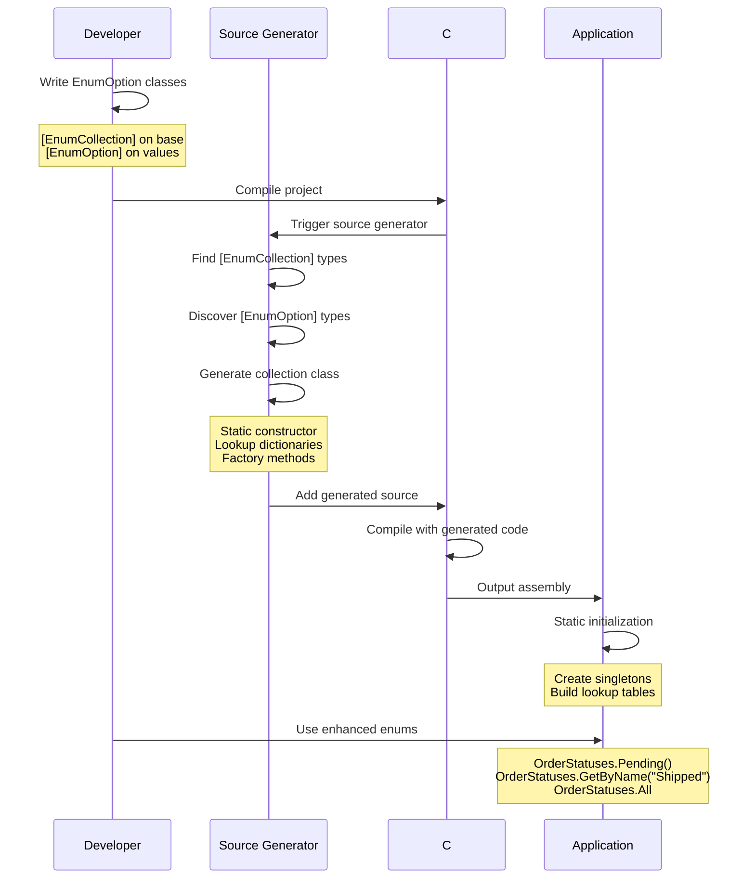

# FractalDataWorks Enhanced Enums

[](https://www.nuget.org/packages/FractalDataWorks.EnhancedEnums/)
[](LICENSE)

A powerful source generator for creating type-safe, object-oriented enumerations in C# with zero boilerplate.

## Table of Contents

- [Overview](#overview)
- [Installation](#installation)
- [Quick Start](#quick-start)
- [Features](#features)
- [Advanced Usage](#advanced-usage)
- [Performance](#performance)
- [API Reference](#api-reference)
- [Troubleshooting](#troubleshooting)
- [Contributing](#contributing)

## Overview

Enhanced Enums transforms simple class hierarchies into powerful, type-safe enumerations with:

- **Static Factory Methods**: Access enum values with compile-time safety (e.g., `OrderStatuses.Pending()`)
- **Efficient Lookups**: O(1) dictionary-based lookups by name or custom properties
- **Rich Objects**: Enum values can have methods, properties, and complex behavior
- **Source Generation**: All code generated at compile-time with zero runtime overhead
- **Singleton Pattern**: Each enum value is instantiated once and reused

### How It Works



## Installation

### Package Installation

Add both required packages to your project:

```bash
# Add the source generator package
dotnet add package FractalDataWorks.EnhancedEnums --prerelease

# Add the attributes and base types package  
dotnet add package FractalDataWorks --prerelease
```

Or add to your `.csproj`:

```xml
<PackageReference Include="FractalDataWorks.EnhancedEnums" Version="*" />
<PackageReference Include="FractalDataWorks" Version="*" />
```

Both packages are required:
- `FractalDataWorks.EnhancedEnums` - Contains the source generator
- `FractalDataWorks` - Provides the attributes and `EnumOptionBase<T>` class

### Project Setup

1. Ensure your project targets .NET 6.0 or later
2. Enable nullable reference types (recommended):
   ```xml
   <PropertyGroup>
     <Nullable>enable</Nullable>
   </PropertyGroup>
   ```
3. Clean and rebuild your solution after adding packages
4. The source generator will automatically run during compilation

## Quick Start

### 1. Define Your Enhanced Enum

```csharp
using FractalDataWorks;

[EnumCollection(CollectionName = "OrderStatuses")]
public abstract class OrderStatusOptionBase : EnumOptionBase<OrderStatusOptionBase>
{
    public abstract bool CanCancel { get; }
    
    // Constructor must include all abstract properties as parameters
    protected OrderStatusOptionBase(int id, string name, bool canCancel) : base(id, name)
    {
        CanCancel = canCancel;
    }
}

[EnumOption]
public class Pending : OrderStatusOptionBase
{
    public Pending() : base(1, "Pending", true) { }
}

[EnumOption]
public class Processing : OrderStatusOptionBase
{
    public Processing() : base(2, "Processing", true) { }
}

[EnumOption]
public class Shipped : OrderStatusOptionBase
{
    public Shipped() : base(3, "Shipped", false) { }
}
```

### 2. Use the Generated Collection

```csharp
// Access all values
foreach (var status in OrderStatuses.All)
{
    Console.WriteLine($"{status.Name}: Can Cancel = {status.CanCancel}");
}

// Factory methods (generated by default)
var pending = OrderStatuses.Pending();
var shipped = OrderStatuses.Shipped();

// Lookup by name
var status = OrderStatuses.GetByName("Processing");

// Safe lookup
if (OrderStatuses.TryGetByName("Unknown", out var found))
{
    // Handle found status
}

// Empty value pattern
var none = OrderStatuses.Empty; // Returns EmptyOrderStatus instance
```

## Features

### Base Class Pattern

Enhanced Enums provides a built-in `EnumOptionBase<T>` class that enforces the Id and Name pattern:

**NAMING CONVENTION:** Base classes should be named `<EnumTypeName>OptionBase` or `<EnumTypeName>EnumOptionBase`

```csharp
// REQUIRED: All enhanced enums must inherit from EnumOptionBase<T>
// REQUIRED: CollectionName must be explicitly specified
// NAMING: Use <EnumTypeName>OptionBase pattern
[EnumCollection(CollectionName = "Statuses")]
public abstract class StatusOptionBase : EnumOptionBase<StatusOptionBase>
{
    protected StatusOptionBase(int id, string name) : base(id, name) { }
}

// You can add additional properties to your base class
[EnumCollection(CollectionName = "CustomStatuses")]
public abstract class CustomStatusOptionBase : EnumOptionBase<CustomStatusOptionBase>
{
    public abstract string Code { get; }
    
    // Constructor must include all abstract properties
    protected CustomStatusOptionBase(int id, string name, string code) : base(id, name)
    {
        Code = code;
    }
}
```

### Empty Value Pattern

Every generated collection includes an `Empty` property that returns a singleton empty/null instance:

```csharp
var empty = OrderStatuses.Empty; // Singleton instance
// Empty values:
// - Have Id = 0 and Name = string.Empty
// - Return default values for all methods
// - Return null/default for all properties
```

### Factory Method Control

Factory methods are disabled by default for best performance. Enable them when needed:

```csharp
// Collection level - affects all options (default is false)
[EnumCollection(CollectionName = "Statuses", GenerateFactoryMethods = true)]
public abstract class StatusOptionBase : EnumOptionBase<StatusOptionBase> 
{
    protected StatusOptionBase(int id, string name) : base(id, name) { }
}

// Option level - overrides collection setting
[EnumOption(GenerateFactoryMethod = true)]
public class SpecialStatus : StatusOptionBase 
{
    public SpecialStatus() : base(1, "Special") { }
}
```

When factory methods are disabled, use `GetByName()` for best performance.

### Return Type Configuration

Specify custom return types for better API design:

```csharp
// For non-generic base types
[EnumCollection(CollectionName = "OrderStatuses", ReturnType = typeof(IOrderStatus))]
public abstract class OrderStatusOptionBase : EnumOptionBase<OrderStatusOptionBase>, IOrderStatus 
{
    protected OrderStatusOptionBase(int id, string name) : base(id, name) { }
}

// For generic base types
[EnumCollection(CollectionName = "Messages", DefaultGenericReturnType = typeof(IMessage))]
public abstract class MessageOptionBase<T> : EnumOptionBase<MessageOptionBase<T>>, IMessage 
{
    protected MessageOptionBase(int id, string name) : base(id, name) { }
}
```

### Lookup Properties

Generate custom lookup methods for any property using the `[EnumLookup]` attribute:

**IMPORTANT:** All abstract properties must either:
1. Be included as constructor parameters, OR
2. Be nullable, OR  
3. Use factory method generation with parameters mapped to the accessor method signature

```csharp
using FractalDataWorks.Attributes;

[EnumCollection(CollectionName = "Countries")]
public abstract class CountryOptionBase : EnumOptionBase<CountryOptionBase>
{
    [EnumLookup] // Generates GetByIsoCode()
    public abstract string IsoCode { get; }
    
    [EnumLookup(MethodName = "FindByCapital")] // Custom method name
    public abstract string Capital { get; }
    
    [EnumLookup(AllowMultiple = true)] // Returns multiple matches
    public abstract string Currency { get; }
    
    [EnumLookup(ReturnType = typeof(ICountry))] // Custom return type
    public abstract string Region { get; }
    
    // Constructor must include ALL abstract properties as parameters
    protected CountryOptionBase(int id, string name, string isoCode, string capital, string currency, string region) 
        : base(id, name)
    {
        IsoCode = isoCode;
        Capital = capital;
        Currency = currency;
        Region = region;
    }
    
    // Alternative: Make properties nullable
    // [EnumLookup]
    // public abstract string? OptionalProperty { get; }
}

[EnumOption]
public class USA : CountryOptionBase
{
    public USA() : base(1, "United States", "US", "Washington", "USD", "North America") { }
}

[EnumOption]
public class Canada : CountryOptionBase
{
    public Canada() : base(2, "Canada", "CA", "Ottawa", "USD", "North America") { }
}
```

#### Alternative: Factory Method Generation

When using factory methods, parameters can be mapped to the factory method signature:

```csharp
[EnumCollection(CollectionName = "Countries", GenerateFactoryMethods = true)]
public abstract class CountryOptionBase : EnumOptionBase<CountryOptionBase>
{
    [EnumLookup]
    public abstract string IsoCode { get; }
    
    [EnumLookup] 
    public abstract string Capital { get; }
    
    protected CountryOptionBase(int id, string name) : base(id, name) { }
}

[EnumOption]
public class USA : CountryOptionBase
{
    public USA() : base(1, "United States") { }
    public USA(string customCapital) : base(1, "United States") 
    { 
        Capital = customCapital; 
    }
    
    public override string IsoCode => "US";
    public override string Capital { get; }
}

// Generated factory methods will include constructor parameters:
// Countries.USA() -> USA with default capital
// Countries.USA("Washington DC") -> USA with custom capital
```

**Generated lookup methods:**
```csharp
// Single value lookups (default behavior)
var usa = Countries.GetByIsoCode("US");                    // CountryOptionBase?
var france = Countries.FindByCapital("Paris");             // CountryOptionBase?
var northAmerica = Countries.GetByRegion("North America"); // ICountry? (custom return type)

// Multiple value lookup (AllowMultiple = true)
var usdCountries = Countries.GetByCurrency("USD");         // ImmutableArray<CountryOptionBase>

// All lookup methods have TryGet variants for safe access
if (Countries.TryGetByIsoCode("UK", out var uk))
{
    Console.WriteLine($"Found: {uk.Name}");
}
```

### Multiple Collections

Organize enum values into multiple collections:

```csharp
[EnumCollection("ActiveStatuses")]
[EnumCollection("InactiveStatuses")]
public abstract class StatusOptionBase : EnumOptionBase<StatusOptionBase>
{
    protected StatusOptionBase(int id, string name) : base(id, name) { }
}

[EnumOption(CollectionName = "ActiveStatuses")]
public class Running : StatusOptionBase
{
    public Running() : base(1, "Running") { }
}

[EnumOption(CollectionName = "InactiveStatuses")]
public class Stopped : StatusOptionBase
{
    public Stopped() : base(2, "Stopped") { }
}

// Usage:
var active = ActiveStatuses.All;
var inactive = InactiveStatuses.All;
```

### Custom Return Types

Control the return type of generated methods:

```csharp
public interface IMessage
{
    int Id { get; }
    string Name { get; }
    string GetContent();
}

[EnumCollection(CollectionName = "MessageTypes", ReturnType = typeof(IMessage))]
public abstract class MessageTypeOptionBase : EnumOptionBase<MessageTypeOptionBase>, IMessage
{
    public abstract string GetContent();
    
    // Constructor includes all abstract properties/methods - but GetContent() is a method, so not needed
    protected MessageTypeOptionBase(int id, string name) : base(id, name) { }
}

// Generated methods return IMessage:
IMessage welcome = MessageTypes.Welcome();
```

### Constructor Support

Enhanced Enums support constructors for initialization:

```csharp
[EnumCollection(CollectionName = "LogLevels")]
public abstract class LogLevelOptionBase : EnumOptionBase<LogLevelOptionBase>
{
    public abstract int Value { get; }
    
    protected LogLevelOptionBase(int id, string name, int value) : base(id, name)
    {
        Value = value;
    }
}

[EnumOption]
public class Error : LogLevelOptionBase
{
    public Error() : base(1, "ERROR", 1) { }
}

[EnumOption]
public class Warning : LogLevelOptionBase
{
    public Warning() : base(2, "WARN", 2) { }
}
```

### Primary Constructors (C# 12+)

Works seamlessly with primary constructors:

```csharp
[EnumCollection(CollectionName = "Sizes")]
public abstract class SizeOptionBase : EnumOptionBase<SizeOptionBase>
{
    public abstract int Value { get; }
    
    protected SizeOptionBase(int id, string name, int value) : base(id, name)
    {
        Value = value;
    }
}

[EnumOption]
public class Small : SizeOptionBase
{
    public Small() : base(1, "Small", 1) { }
}

[EnumOption]
public class Medium : SizeOptionBase
{
    public Medium() : base(2, "Medium", 2) { }
}

[EnumOption]
public class Large : SizeOptionBase
{
    public Large() : base(3, "Large", 3) { }
}
```

## Advanced Usage

### Generic Enhanced Enums

Full support for generic base types with type constraints:

```csharp
// Single type parameter - methods don't require constructor parameters
[EnumCollection(CollectionName = "Handlers")]
public abstract class HandlerOptionBase<T> : EnumOptionBase<HandlerOptionBase<T>>
{
    public abstract void Handle(T item);
    protected HandlerOptionBase(int id, string name) : base(id, name) { }
}

[EnumOption]
public class StringHandler : HandlerOptionBase<string>
{
    public StringHandler() : base(1, "String") { }
    public override void Handle(string item) => Console.WriteLine(item);
}

// Multiple type parameters with constraints - methods don't require constructor parameters
[EnumCollection(CollectionName = "Converters", DefaultGenericReturnType = typeof(IConverter))]
public abstract class ConverterOptionBase<TInput, TOutput> : EnumOptionBase<ConverterOptionBase<TInput, TOutput>>, IConverter
    where TInput : class
    where TOutput : struct
{
    public abstract TOutput Convert(TInput input);
    protected ConverterOptionBase(int id, string name) : base(id, name) { }
}
```

### Factory Method Behavior

Factory methods are disabled by default for best performance. When enabled, they create **new instances** (not singletons):

```csharp
[EnumCollection(CollectionName = "Statuses", GenerateFactoryMethods = true)]
public abstract class StatusOptionBase : EnumOptionBase<StatusOptionBase>
{
    public abstract string? Reason { get; }
    
    protected StatusOptionBase(int id, string name, string? reason) : base(id, name)
    {
        Reason = reason;
    }
}

[EnumOption]
public class Active : StatusOptionBase
{
    public Active() : base(1, "Active", null) { }
    public Active(string reason) : base(1, "Active", reason) { }
}

// Usage:
var instance1 = Statuses.Active();           // new Active()
var instance2 = Statuses.Active("Started");  // new Active("Started")
var singleton = Statuses.GetByName("Active"); // Returns cached singleton
```

#### Disabling Factory Methods

```csharp
// Disable at collection level
[EnumCollection(CollectionName = "ConfigOptions", GenerateFactoryMethods = false)]
public abstract class ConfigOptionBase : EnumOptionBase<ConfigOptionBase>
{
    protected ConfigOptionBase(int id, string name) : base(id, name) { }
}

// Disable for specific option
[EnumOption(GenerateFactoryMethod = false)]
public class SpecialConfig : ConfigOptionBase
{
    public SpecialConfig() : base(99, "Special") { }
}
```

When factory methods are disabled, enum options **must** have a public parameterless constructor.

### Case-Sensitive Lookups

```csharp
[EnumCollection(CollectionName = "CaseSensitiveEnums", NameComparison = StringComparison.Ordinal)]
public abstract class CaseSensitiveEnumOptionBase : EnumOptionBase<CaseSensitiveEnumOptionBase>
{
    protected CaseSensitiveEnumOptionBase(int id, string name) : base(id, name) { }
    // Name lookups will be case-sensitive
}
```

## Performance

Enhanced Enums are optimized for performance:

- **Initialization**: One-time cost during static constructor
- **Factory Methods**: O(1) - Creates new instance quickly
- **Name Lookups**: O(1) - Dictionary lookup (FrozenDictionary on .NET 8+)
- **Property Lookups**: O(1) - Dictionary lookup for single values
- **Memory**: Minimal - Single instance per enum value

### .NET 8+ Optimizations

On .NET 8 or later, the generator uses `FrozenDictionary` for even better performance:
- ~15% faster lookups
- Optimized memory layout
- Better CPU cache utilization

## API Reference

### Attributes

#### `[EnumCollection]`

Marks a type as an enhanced enum base. Applied to abstract classes that inherit from `EnumOptionBase<T>`.

**Properties:**
- `CollectionName` (string): **REQUIRED** - Name of the generated collection class. Must be explicitly specified.
- `GenerateFactoryMethods` (bool): Generate static factory methods. Default: `false`
- `NameComparison` (StringComparison): How to compare names. Default: `Ordinal`
- `ReturnType` (Type): Return type for generated methods. Use `typeof(IMyInterface)`. Default: Base type
- `DefaultGenericReturnType` (Type): Return type for generic enhanced enums. Use `typeof(IMyInterface)`. Default: Base type
- `Namespace` (string): Namespace for the generated collection class. Default: Same as base type

#### `[EnumOption]`

Marks a type as an enum option. Applied to concrete classes that inherit from an enhanced enum base.

**Properties:**
- `Name` (string): Override the display name. Default: Class name
- `CollectionName` (string): Target collection for multiple collection scenarios
- `ReturnType` (Type): Custom return type for this specific enum option. Use `typeof(IMyInterface)`. Default: Uses collection's return type
- `GenerateFactoryMethod` (bool?): Override factory method generation for this option. Default: null (uses collection setting)
- `MethodName` (string): Custom method name for the factory method. Default: Uses Name property or class name

#### `[EnumLookup]`

Generates a lookup method for a property. Applied to properties in the base class.

**Properties:**
- `MethodName` (string): Name of generated method. Default: `GetBy{PropertyName}`
- `AllowMultiple` (bool): Return multiple matches. Default: `false`
- `ReturnType` (Type): Custom return type for this lookup method. Use `typeof(IMyInterface)`. Default: Uses collection's return type

**Requirements:**
- Property must be abstract or virtual
- Property must be either:
  - Included as constructor parameter, OR
  - Nullable, OR
  - Used with factory method generation

### Generated Methods

For an enhanced enum `OrderStatus`, the generator creates `OrderStatuses` with:

```csharp
// Properties
public static ImmutableArray<OrderStatus> All { get; }
public static OrderStatus Empty { get; }

// Factory methods (if enabled) - create new instances
public static OrderStatus Pending() => new Pending();
public static OrderStatus Shipped() => new Shipped();

// Constructor overloads generate method overloads
public static OrderStatus Pending(string reason) => new Pending(reason);

// Lookup methods
public static OrderStatus GetByName(string name);
public static bool TryGetByName(string name, out OrderStatus? value);

// Custom lookups (for [EnumLookup] properties)
public static OrderStatus GetByCode(string code);
public static ImmutableArray<OrderStatus> GetByCategory(string category); // If AllowMultiple
```

## Troubleshooting

### Generator Not Running

1. Ensure both packages are referenced:
   ```xml
   <PackageReference Include="FractalDataWorks.EnhancedEnums" Version="*" />
   <PackageReference Include="FractalDataWorks" Version="*" />
   ```

2. Clean and rebuild your solution

3. Check for compilation errors - generators don't run if there are errors

### Missing Base Class

The base class MUST inherit from `EnumOptionBase<T>`:

```csharp
// ❌ Wrong
[EnumCollection(CollectionName = "Statuses")]
public abstract class StatusOptionBase
{
    public abstract string Name { get; }
}

// ✅ Correct
[EnumCollection(CollectionName = "Statuses")]
public abstract class StatusOptionBase : EnumOptionBase<StatusOptionBase>
{
    protected StatusOptionBase(int id, string name) : base(id, name) { }
}
```

### No Empty Value Generated

Ensure your base class has accessible abstract members:

```csharp
[EnumCollection(CollectionName = "Statuses")]
public abstract class StatusOptionBase : EnumOptionBase<StatusOptionBase>
{
    // Id and Name come from base class
    public abstract string Code { get; }  // ✅ Will be implemented in Empty
    
    public string Description { get; set; }  // ❌ Not abstract, won't be in Empty
    
    // Constructor must include all abstract properties
    protected StatusOptionBase(int id, string name, string code) : base(id, name)
    {
        Code = code;
    }
}
```

## Complete Feature List

### Core Features

1. **Static Collection Generation**
   - Generates a static class (e.g., `OrderStatuses` for `OrderStatus`)
   - Provides `All` property returning `ImmutableArray<T>`
   - Singleton instances created at static initialization
   - Thread-safe initialization guaranteed

2. **Efficient Lookups**
   - `GetByName(string)` - O(1) dictionary lookup
   - `TryGetByName(string, out T)` - Safe lookup pattern
   - Custom property lookups via `[EnumLookup]` attribute
   - Case-sensitive by default (configurable via `NameComparison`)
   - .NET 8+: Uses `FrozenDictionary` for ~15% better performance

3. **Factory Methods**
   - Disabled by default for best performance
   - When enabled, create **new instances** (not singletons)
   - Support constructor overloads automatically
   - Can be enabled globally or per-option
   - Analyzer ENH005 ensures parameterless constructor when disabled

4. **Empty Value Pattern**
   - Every collection has an `Empty` property
   - Returns singleton instance with Id=0, Name=string.Empty
   - All abstract properties return appropriate defaults:
     - `string` → `string.Empty`
     - `bool` → `false`
     - `int/long/etc` → `0`
     - Reference types → `null`
   - Abstract methods properly overridden

5. **Generic Type Support**
   - Full support for generic base types
   - Multiple type parameters
   - Type constraints preserved in generated code
   - Automatic namespace resolution
   - `DefaultGenericReturnType` for complex scenarios

6. **Multiple Collections**
   - Create multiple collections from same base type
   - Organize options into logical groups
   - Each collection is independent
   - Options specify target via `CollectionName`

7. **Custom Return Types**
   - Specify interface or base type as return
   - Supports covariance patterns
   - Works with both generic and non-generic types
   - All generated methods use specified return type

8. **C# Language Support**
   - Primary constructor detection (C# 12+)
   - Record type support
   - File-scoped namespaces
   - Nullable reference types
   - Init-only properties

### Code Generation Features

9. **Performance Optimizations**
   - Zero reflection at runtime
   - Compile-time code generation
   - Singleton pattern for zero allocations on lookups
   - Immutable collections prevent modifications
   - Minimal memory footprint

10. **Comprehensive XML Documentation**
    - All generated methods have full XML docs
    - IntelliSense support for all members
    - Parameter descriptions
    - Return value documentation
    - Exception documentation where applicable

11. **Incremental Generation**
    - Only regenerates when source changes
    - Efficient compilation performance
    - Works with hot reload

### Analyzers and Diagnostics

12. **Built-in Analyzers**
    - **ENH001**: Missing EnumOptionBase inheritance
    - **ENH002**: Constructor must call base
    - **ENH003**: Cannot be static class
    - **ENH004**: Duplicate enum options detected
    - **ENH005**: Missing parameterless constructor when factory disabled
    - **ENH006**: Abstract property should be virtual (with code fix)
    - **ENH007**: Fields cannot be abstract

13. **Code Fixes**
    - Automatic fixes for common issues
    - Add missing base class inheritance
    - Generate required constructors

### Advanced Scenarios

14. **Attribute Configuration**
    - `[EnumCollection]` - Configure collection generation
    - `[EnumOption]` - Mark and configure enum values
    - `[EnumLookup]` - Generate custom lookup methods
    - All attributes support named parameters

15. **Namespace Control**
    - Generate collections in different namespaces
    - Automatic using statement generation
    - Handles nested namespaces correctly

16. **Extensibility**
    - Base class can have additional abstract members
    - Support for methods with parameters
    - Properties can have any type
    - Works with dependency injection patterns

## Contributing

We welcome contributions! Please see our [Contributing Guide](CONTRIBUTING.md) for details.

### Building from Source

```bash
# Clone the repository
git clone https://github.com/FractalDataWorks/enhanced-enums.git

# Build
dotnet build

# Run tests
dotnet test

# Pack NuGet package
dotnet pack
```

## License

This project is licensed under the Apache License 2.0 - see the [LICENSE](LICENSE) file for details.