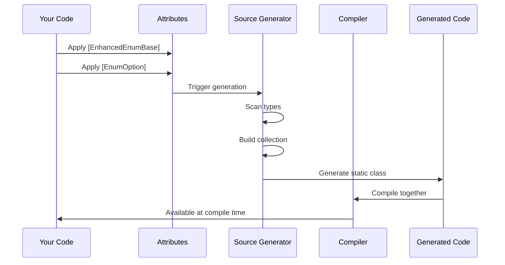
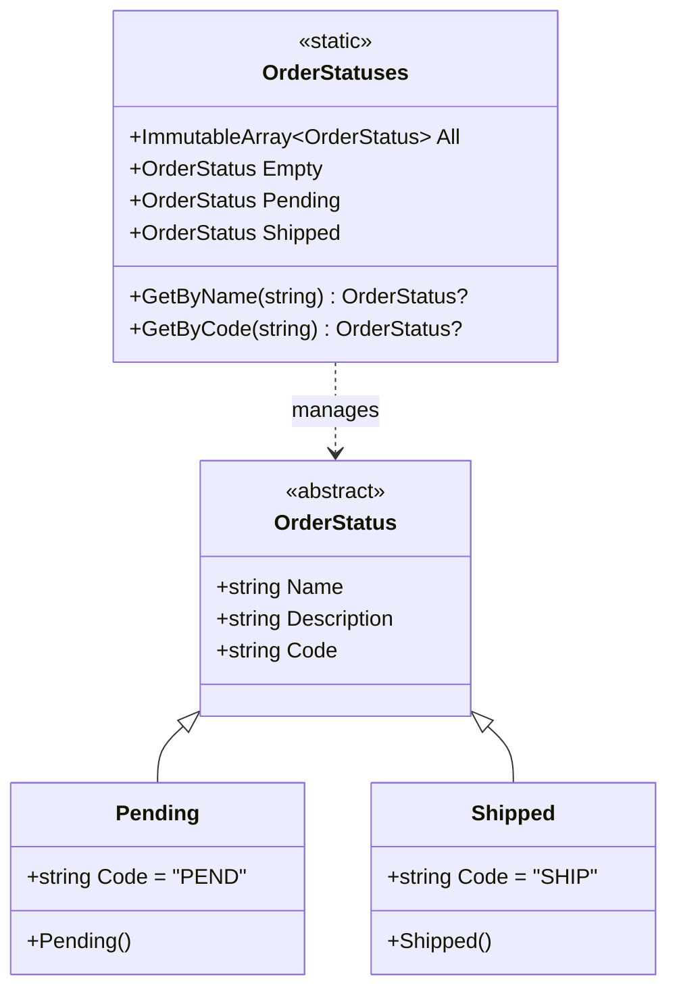

# FractalDataWorks Enhanced Enums

[](https://www.nuget.org/packages/FractalDataWorks.EnhancedEnums/)
[](https://opensource.org/licenses/Apache-2.0)

Advanced enumeration patterns with source generation for .NET applications.

## Table of Contents

- [Overview](#overview)
- [Installation](#installation)
- [Quick Start](#quick-start)
- [Features](#features)
- [Performance](#performance)
- [Architecture](#architecture)
- [API Reference](#api-reference)
- [Developer Guide](#developer-guide)
- [Troubleshooting](#troubleshooting)
- [Contributing](#contributing)

## Overview

FractalDataWorks Enhanced Enums provides a powerful alternative to standard C# enums with:

- **Type-safe enumeration patterns** with compile-time validation
- **Source generation** for zero boilerplate
- **High-performance lookups** with O(1) dictionary access
- **Rich metadata support** through properties and attributes  
- **Cross-assembly support** for shared enum definitions
- **Empty value pattern** for "no selection" scenarios
- **Static property accessors** for direct enum value access

## Installation

### NuGet Package

```bash
dotnet add package FractalDataWorks.EnhancedEnums
```

### Package Reference

```xml
<PackageReference Include="FractalDataWorks.EnhancedEnums" Version="*" />
```

## Quick Start

### 1. Define Your Enhanced Enum

```csharp
using FractalDataWorks.EnhancedEnums.Attributes;

[EnhancedEnumBase]
public abstract class OrderStatus
{
    protected OrderStatus(string name, string description)
    {
        Name = name;
        Description = description;
    }
    
    public string Name { get; }
    public string Description { get; }
    
    [EnumLookup]
    public abstract string Code { get; }
}

[EnumOption]
public class Pending : OrderStatus
{
    public Pending() : base("Pending", "Order is pending") { }
    public override string Code => "PEND";
}

[EnumOption]
public class Shipped : OrderStatus
{
    public Shipped() : base("Shipped", "Order has shipped") { }
    public override string Code => "SHIP";
}
```

### 2. Use the Generated Collection

```csharp
// Get all values
foreach (var status in OrderStatuses.All)
{
    Console.WriteLine($"{status.Name}: {status.Description}");
}

// Lookup by name
var pending = OrderStatuses.GetByName("Pending");

// Lookup by custom property
var shipped = OrderStatuses.GetByCode("SHIP");

// Direct static access
var status = OrderStatuses.Pending;

// Empty value
var none = OrderStatuses.Empty;
```

## Features

### Lookup Properties

Mark properties with `[EnumLookup]` to generate efficient lookup methods:

```csharp
[EnhancedEnumBase]
public abstract class Country
{
    public abstract string Name { get; }
    
    [EnumLookup]
    public abstract string IsoCode { get; }
    
    [EnumLookup(MethodName = "FindByCurrency")]
    public abstract string Currency { get; }
}

// Usage
var us = Countries.GetByIsoCode("US");
var euroCountries = Countries.FindByCurrency("EUR");
```

### Multiple Collections

Support multiple categorizations of the same base type:

```csharp
[EnhancedEnumBase("ActiveStatuses")]
[EnhancedEnumBase("ErrorStatuses")]
public abstract class Status
{
    public abstract string Name { get; }
}

[EnumOption(CollectionName = "ActiveStatuses")]
public class Running : Status { }

[EnumOption(CollectionName = "ErrorStatuses")]
public class Failed : Status { }
```

### Interface-Based Return Types

Control return types for flexible hierarchies:

```csharp
public interface IOrderStatus : IEnhancedEnumOption
{
    string Description { get; }
}

[EnhancedEnumBase(ReturnType = "IOrderStatus")]
public abstract class OrderStatus : IOrderStatus
{
    public abstract int Id { get; }
    public abstract string Name { get; }
    public abstract string Description { get; }
}
```

### Cross-Assembly Support

Share enum definitions across projects:

```csharp
[EnhancedEnumBase(IncludeReferencedAssemblies = true)]
public abstract class SharedStatus
{
    public abstract string Name { get; }
}
```

## Performance

Enhanced Enums are optimized for high-performance scenarios:

```mermaid
graph LR
    A[Lookup Request] --> B{Lookup Type}
    B -->|By Name| C[O(1) Dictionary]
    B -->|By Property| D[O(1) Dictionary]
    B -->|All Values| E[Cached Array]
    C --> F[Zero Allocations]
    D --> F
    E --> F
```

Benchmark results show:
- **9x faster lookups** compared to LINQ searches
- **Zero allocations** for all operations
- **35% additional improvement** with .NET 8+ FrozenDictionary

## Architecture

### Source Generation Flow



### Generated Code Structure



## API Reference

### Attributes

#### `[EnhancedEnumBase]`

Marks a class as an enhanced enum base type.

```csharp
[EnhancedEnumBase(
    CollectionName = "MyStatuses",              // Custom collection name
    UseFactory = false,                         // Use factory pattern
    NameComparison = StringComparison.OrdinalIgnoreCase,  // Name comparison
    IncludeReferencedAssemblies = false,        // Cross-assembly scanning
    ReturnType = "IMyStatus"                    // Custom return type
)]
```

#### `[EnumOption]`

Marks a class as an enum option.

```csharp
[EnumOption(
    Name = "CustomName",           // Override display name
    Order = 1,                     // Sort order
    CollectionName = "MyCollection" // Target collection
)]
```

#### `[EnumLookup]`

Marks a property for lookup generation.

```csharp
[EnumLookup(
    MethodName = "FindByCode",     // Custom method name
    AllowMultiple = false,         // Allow multiple matches
    ReturnType = "IMyStatus"       // Custom return type
)]
```

### Generated Methods

Every generated collection includes:

- `ImmutableArray<T> All` - All enum values
- `T Empty` - Empty/none value
- `T? GetByName(string name)` - Lookup by name
- `T? GetByXxx(...)` - Custom lookups for `[EnumLookup]` properties
- Static properties for each enum value

## Developer Guide

### Project Structure

```
FractalDataWorks.EnhancedEnums/
├── src/
│   ├── Attributes/           # Attribute definitions
│   ├── Analyzers/           # Roslyn analyzers
│   ├── Generators/          # Source generators
│   └── Models/              # Data models
├── tests/                   # Unit tests
├── benchmarks/             # Performance benchmarks
└── samples/                # Example projects
```

### Building from Source

```bash
# Clone repository
git clone https://github.com/FractalDataWorks/enhanced-enums.git

# Build
dotnet build

# Run tests
dotnet test

# Run benchmarks
dotnet run -c Release --project benchmarks/FractalDataWorks.EnhancedEnums.Benchmarks
```

### Adding New Features

1. **Attributes**: Define in `Attributes/` folder
2. **Generation Logic**: Modify `EnhancedEnumGenerator.cs`
3. **Tests**: Add to appropriate test project
4. **Documentation**: Update this README

### Testing Source Generators

```csharp
[Fact]
public void GeneratesCollectionClass()
{
    var source = @"
        [EnhancedEnumBase]
        public abstract class Status { }
        
        [EnumOption]
        public class Active : Status { }
    ";
    
    var result = TestHelper.GenerateSource(source);
    
    result.ShouldContain("public static class Statuses");
    result.ShouldContain("public static Status Active");
}
```

### Debugging Tips

1. **Enable generator logging**:
   ```xml
   <PropertyGroup>
     <EmitCompilerGeneratedFiles>true</EmitCompilerGeneratedFiles>
   </PropertyGroup>
   ```

2. **Check generated files**: Look in `obj/Generated/`

3. **Use diagnostics**: The generator reports informational diagnostics

### Performance Considerations

1. **Use constructor patterns** for better performance
2. **Avoid complex logic** in enum constructors
3. **Consider .NET 8+** for FrozenDictionary benefits
4. **Cache enum instances** - they're singletons

## Troubleshooting

### Source Generator Not Running

1. Ensure proper package/project reference configuration
2. Check for build errors preventing generation
3. Clean and rebuild the solution

### Missing Generated Code

1. Verify attributes are applied correctly
2. Check that base class is `abstract`
3. Ensure enum options are `public` and non-abstract

### Performance Issues

1. Review constructor complexity
2. Check for excessive cross-assembly scanning
3. Profile with included benchmarks

## Contributing

We welcome contributions! Please see our [Contributing Guide](CONTRIBUTING.md) for details.

### Development Setup

1. Fork the repository
2. Create a feature branch
3. Make your changes
4. Add tests
5. Submit a pull request

### Code Style

- Follow existing patterns
- Add XML documentation
- Include unit tests
- Update benchmarks if needed

## License

This project is licensed under the Apache License 2.0 - see the [LICENSE](LICENSE) file for details.